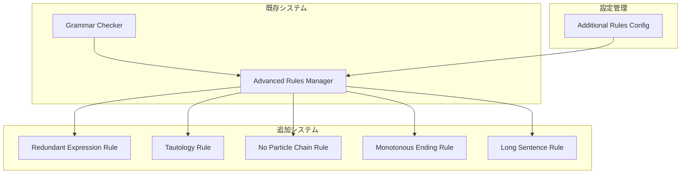

# 設計書

## 概要

本システムは、既存の日本語文法解析機能をさらに拡張し、5種類の追加文法チェックルールを提供する。各ルールは独立したモジュールとして実装され、設定により個別に有効/無効を切り替え可能とする。

主要機能：
- 冗長表現の検出（「馬から落馬する」など）
- 重複表現（同語反復）の検出（「頭痛が痛い」など）
- 助詞「の」の連続使用検出（3回以上の連続）
- 文末表現の単調さ検出（同じ文末が3回以上連続）
- 長すぎる文の検出（120文字超過）
- ルールごとの設定管理

## アーキテクチャ

### システム構成



### 設計原則

1. **単一責任の原則**: 各ルールは1つの文法チェックのみを担当
2. **開放閉鎖の原則**: 新しいルールの追加が既存コードに影響しない
3. **依存性逆転の原則**: 具体的なルールではなく抽象的なインターフェースに依存
4. **設定駆動**: すべてのルールは設定により制御可能

## コンポーネントとインターフェース

### 1. Redundant Expression Rule (server/src/grammar/rules/redundantExpressionRule.ts)

冗長表現を検出する。

```typescript
interface RedundantExpressionRule extends AdvancedGrammarRule {
  detectRedundantExpressions(text: string): RedundantExpression[];
  getSuggestion(expression: RedundantExpression): string;
}

interface RedundantExpression {
  pattern: string;
  redundantPart: string;
  suggestion: string;
  range: Range;
}

const REDUNDANT_PATTERNS: Map<string, string> = new Map([
  ['馬から落馬', '落馬'],
  ['後で後悔', '後悔'],
  ['一番最初', '最初'],
  ['各々それぞれ', 'それぞれ'],
  ['まず最初に', '最初に'],
  ['過半数を超える', '過半数'],
  ['元旦の朝', '元旦'],
  ['炎天下の下', '炎天下'],
  ['頭頂部の頭', '頭頂部'],
  ['射程距離', '射程']
]);
```

### 2. Tautology Rule (server/src/grammar/rules/tautologyRule.ts)

重複表現（同語反復）を検出する。

```typescript
interface TautologyRule extends AdvancedGrammarRule {
  detectTautologies(text: string): Tautology[];
  getSuggestion(tautology: Tautology): string[];
}

interface Tautology {
  pattern: string;
  duplicatedElement: string;
  suggestions: string[];
  range: Range;
}

const TAUTOLOGY_PATTERNS: Map<string, string[]> = new Map([
  ['頭痛が痛い', ['頭が痛い', '頭痛がする']],
  ['違和感を感じる', ['違和感がある', '違和感を覚える']],
  ['被害を被る', ['被害を受ける', '被害にあう']],
  ['犯罪を犯す', ['罪を犯す', '犯罪を行う']],
  ['危険が危ない', ['危険がある', '危ない']],
  ['心配が心配', ['心配がある', '心配だ']],
  ['不安が不安', ['不安がある', '不安だ']],
  ['問題が問題', ['問題がある', '問題だ']]
]);
```

### 3. No Particle Chain Rule (server/src/grammar/rules/noParticleChainRule.ts)

助詞「の」の連続使用を検出する。

```typescript
interface NoParticleChainRule extends AdvancedGrammarRule {
  detectNoChains(tokens: Token[], threshold: number): NoParticleChain[];
  suggestRewrite(chain: NoParticleChain): string[];
}

interface NoParticleChain {
  tokens: Token[];
  chainLength: number;
  range: Range;
  suggestions: string[];
}
```

### 4. Monotonous Ending Rule (server/src/grammar/rules/monotonousEndingRule.ts)

文末表現の単調さを検出する。

```typescript
interface MonotonousEndingRule extends AdvancedGrammarRule {
  detectMonotonousEndings(sentences: Sentence[], threshold: number): MonotonousEnding[];
  suggestVariations(ending: MonotonousEnding): string[];
}

interface MonotonousEnding {
  endingPattern: string;
  sentences: Sentence[];
  consecutiveCount: number;
  range: Range;
  variations: string[];
}

const ENDING_VARIATIONS: Map<string, string[]> = new Map([
  ['です', ['である', 'だ', 'になります', 'となります']],
  ['ます', ['る', 'である', 'だ', 'になる', 'となる']],
  ['である', ['です', 'だ', 'になる', 'となる']],
  ['だ', ['です', 'である', 'になる', 'となる']],
  ['ました', ['た', 'だった', 'でした']],
  ['た', ['ました', 'だった', 'でした']]
]);
```

### 5. Long Sentence Rule (server/src/grammar/rules/longSentenceRule.ts)

長すぎる文を検出する。

```typescript
interface LongSentenceRule extends AdvancedGrammarRule {
  detectLongSentences(sentences: Sentence[], threshold: number): LongSentence[];
  suggestSplit(sentence: LongSentence): string[];
}

interface LongSentence {
  sentence: Sentence;
  characterCount: number;
  threshold: number;
  range: Range;
  splitSuggestions: string[];
}
```

### 6. Additional Rules Config (server/src/grammar/additionalRulesConfig.ts)

追加文法ルールの設定を管理する。

```typescript
interface AdditionalRulesConfig {
  enableRedundantExpression: boolean;
  enableTautology: boolean;
  enableNoParticleChain: boolean;
  enableMonotonousEnding: boolean;
  enableLongSentence: boolean;
  
  noParticleChainThreshold: number;
  monotonousEndingThreshold: number;
  longSentenceThreshold: number;
}

const DEFAULT_ADDITIONAL_CONFIG: AdditionalRulesConfig = {
  enableRedundantExpression: true,
  enableTautology: true,
  enableNoParticleChain: true,
  enableMonotonousEnding: true,
  enableLongSentence: true,
  
  noParticleChainThreshold: 3,
  monotonousEndingThreshold: 3,
  longSentenceThreshold: 120
};
```

## データモデル

### RedundantExpressionDiagnostic（冗長表現診断情報）

```typescript
class RedundantExpressionDiagnostic extends AdvancedDiagnostic {
  redundantPart: string;
  suggestion: string;

  constructor(
    range: Range,
    pattern: string,
    redundantPart: string,
    suggestion: string
  ) {
    super(
      range,
      `冗長表現「${pattern}」が検出されました。「${suggestion}」に簡潔化できます。`,
      'redundant-expression',
      'RedundantExpressionRule',
      [suggestion]
    );
    this.redundantPart = redundantPart;
    this.suggestion = suggestion;
  }
}
```

### TautologyDiagnostic（重複表現診断情報）

```typescript
class TautologyDiagnostic extends AdvancedDiagnostic {
  duplicatedElement: string;
  suggestions: string[];

  constructor(
    range: Range,
    pattern: string,
    duplicatedElement: string,
    suggestions: string[]
  ) {
    super(
      range,
      `重複表現「${pattern}」が検出されました。「${duplicatedElement}」が重複しています。`,
      'tautology',
      'TautologyRule',
      suggestions
    );
    this.duplicatedElement = duplicatedElement;
    this.suggestions = suggestions;
  }
}
```

### NoParticleChainDiagnostic（助詞「の」連続診断情報）

```typescript
class NoParticleChainDiagnostic extends AdvancedDiagnostic {
  chainLength: number;
  threshold: number;

  constructor(
    range: Range,
    chainLength: number,
    threshold: number,
    suggestions: string[]
  ) {
    super(
      range,
      `助詞「の」が${chainLength}回連続しています（閾値: ${threshold}回）。文の書き換えを検討してください。`,
      'no-particle-chain',
      'NoParticleChainRule',
      suggestions
    );
    this.chainLength = chainLength;
    this.threshold = threshold;
  }
}
```

### MonotonousEndingDiagnostic（文末単調さ診断情報）

```typescript
class MonotonousEndingDiagnostic extends AdvancedDiagnostic {
  endingPattern: string;
  consecutiveCount: number;
  threshold: number;

  constructor(
    range: Range,
    endingPattern: string,
    consecutiveCount: number,
    threshold: number,
    variations: string[]
  ) {
    super(
      range,
      `文末「${endingPattern}」が${consecutiveCount}回連続しています（閾値: ${threshold}回）。表現を多様化してください。`,
      'monotonous-ending',
      'MonotonousEndingRule',
      variations
    );
    this.endingPattern = endingPattern;
    this.consecutiveCount = consecutiveCount;
    this.threshold = threshold;
  }
}
```

### LongSentenceDiagnostic（長文診断情報）

```typescript
class LongSentenceDiagnostic extends AdvancedDiagnostic {
  characterCount: number;
  threshold: number;

  constructor(
    range: Range,
    characterCount: number,
    threshold: number,
    splitSuggestions: string[]
  ) {
    super(
      range,
      `文が長すぎます（${characterCount}文字、閾値: ${threshold}文字）。文の分割を検討してください。`,
      'long-sentence',
      'LongSentenceRule',
      splitSuggestions
    );
    this.characterCount = characterCount;
    this.threshold = threshold;
  }
}
```

## 正確性プロパティ

*プロパティとは、システムのすべての有効な実行において真であるべき特性または動作です。本質的には、システムが何をすべきかについての形式的な記述です。プロパティは、人間が読める仕様と機械で検証可能な正確性保証との橋渡しとなります。*

### プロパティリフレクション

プレワーク分析の結果、以下の冗長性を特定しました：

1. **冗長表現の統合**: 要件1.1-1.5は全て冗長表現の検出と提案に関するもので、統合可能
2. **重複表現の統合**: 要件2.1-2.5は全て重複表現の検出と提案に関するもので、統合可能
3. **「の」連続の統合**: 要件3.1-3.4は全て「の」連続の検出と提案に関するもので、統合可能
4. **文末単調さの統合**: 要件4.1-4.5は全て文末単調さの検出と提案に関するもので、統合可能
5. **長文の統合**: 要件5.1-5.4は全て長文の検出と提案に関するもので、統合可能

これらを考慮し、以下のプロパティを定義します。

### プロパティ 1: 冗長表現の検出と提案

*任意の* テキストに対して、冗長表現パターン（「馬から落馬する」「後で後悔する」「一番最初」など）が検出される場合、システムは診断情報を生成し、その診断情報には簡潔な表現への修正提案が含まれる

**検証: 要件 1.1, 1.2, 1.3, 1.4, 1.5**

### プロパティ 2: 重複表現（同語反復）の検出と提案

*任意の* テキストに対して、重複表現パターン（「頭痛が痛い」「違和感を感じる」「被害を被る」など）が検出される場合、システムは診断情報を生成し、その診断情報には適切な表現への修正提案が含まれる

**検証: 要件 2.1, 2.2, 2.3, 2.4, 2.5**

### プロパティ 3: 助詞「の」連続使用の閾値チェック

*任意の* トークンリストに対して、助詞「の」の連続回数が閾値（デフォルト3回）以上の場合、システムは診断情報を生成し、その診断情報には連続回数と文の書き換え提案が含まれる。閾値未満の場合は診断情報を生成しない

**検証: 要件 3.1, 3.2, 3.3, 3.4**

### プロパティ 4: 文末表現の単調さ検出

*任意の* 文のリストに対して、同じ文末表現の連続回数が閾値（デフォルト3回）以上の場合、システムは診断情報を生成し、その診断情報には連続回数と表現の多様化提案が含まれる。異なる文末表現が使用される場合は診断情報を生成しない

**検証: 要件 4.1, 4.2, 4.3, 4.4, 4.5**

### プロパティ 5: 長文の文字数チェック

*任意の* 文に対して、文字数が閾値（デフォルト120文字）を超える場合、システムは診断情報を生成し、その診断情報には文字数と文の分割提案が含まれる。閾値以下の場合は診断情報を生成しない

**検証: 要件 5.1, 5.2, 5.3, 5.4**

### プロパティ 6: 設定変更の即時反映

*任意の* 追加ルール設定項目に対して、値が変更されたとき、システムは新しい設定値に基づいて即座に動作を更新する

**検証: 要件 6.5**

## エラーハンドリング

### パターンマッチングエラー

1. **正規表現エラー**
   - エラーコード: `PATTERN_MATCH_ERROR`
   - 処理: エラーをログに記録し、該当パターンをスキップ
   - リカバリ: 他のパターンは継続処理

2. **文字列解析エラー**
   - エラーコード: `TEXT_ANALYSIS_ERROR`
   - 処理: エラーをログに記録し、部分的な結果を返す
   - リカバリ: 次回の編集時に再試行

### 閾値設定エラー

1. **無効な閾値**
   - エラーコード: `INVALID_THRESHOLD`
   - 処理: デフォルト値を使用し、警告を表示
   - リカバリ: ユーザーに設定の確認を促す

2. **設定範囲外**
   - エラーコード: `THRESHOLD_OUT_OF_RANGE`
   - 処理: 最小値または最大値に調整
   - リカバリ: 調整後の値をユーザーに通知

## テスト戦略

### 二重テストアプローチ

本システムでは、ユニットテストとプロパティベーステストの両方を使用します：

- **ユニットテスト**: 特定の例、エッジケース、エラー条件を検証
- **プロパティベーステスト**: すべての入力にわたって保持されるべき普遍的なプロパティを検証

両者は補完的であり、包括的なカバレッジを提供します。ユニットテストは具体的なバグを捕捉し、プロパティテストは一般的な正確性を検証します。

### ユニットテスト

**対象:**
- 特定の冗長表現パターン（「馬から落馬する」「後で後悔する」など）
- 特定の重複表現パターン（「頭痛が痛い」「違和感を感じる」など）
- 既知の「の」連続パターン（「東京の会社の部長の息子」など）
- 既知の文末単調パターン（「です。です。です。」など）
- 既知の長文例（120文字超過の文）
- エッジケース（空文字列、特殊文字、境界値）
- 設定の読み書き
- エラー条件（無効な設定、範囲外の閾値）

**ツール:** Jest

### プロパティベーステスト

**対象:**
- 冗長表現の検出精度（すべての冗長パターンに対して）
- 重複表現の検出精度（すべての重複パターンに対して）
- 「の」連続の閾値チェック（すべての連続回数に対して）
- 文末単調さの閾値チェック（すべての文末パターンに対して）
- 長文の文字数チェック（すべての文字数に対して）
- 診断情報の完全性（すべてのエラーに対して）
- 設定による動作変更（すべての設定値に対して）
- 偽陽性がないこと（正しい表現に対して）

**ツール:** fast-check（TypeScript用プロパティベーステストライブラリ）

**設定:**
- 各プロパティテストは30回の反復を実行（pbt-configuration.mdに従う）
- 各プロパティテストは設計書の正確性プロパティを明示的に参照
- タグ形式: `**Feature: additional-grammar-rules, Property {number}: {property_text}**`

### 統合テスト

**対象:**
- 追加ルールと既存のAdvanced Rules Managerの統合
- 既存のGrammar Checkerとの統合
- Language Serverとの統合
- 設定管理との統合

**ツール:** Jest + VSCode Extension Test Runner

### パフォーマンステスト

**対象:**
- 大きなファイルでのルール実行時間
- 複数ルールの同時実行
- パターンマッチングの効率性

**基準:**
- 1000行のファイル: 2秒以内
- 各ルールの実行時間: 500ms以内
- メモリ使用量: 追加30MB以下