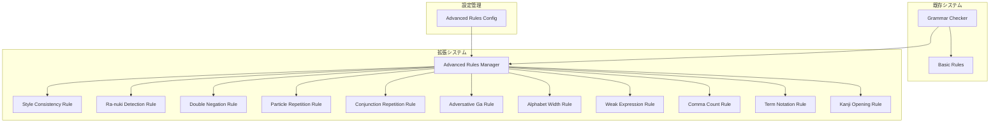

# 設計書

## 概要

本システムは、既存の日本語文法解析機能を拡張し、11種類の高度な文法チェックルールを提供する。各ルールは独立したモジュールとして実装され、設定により個別に有効/無効を切り替え可能とする。

主要機能：
- 文体の混在検出（敬体/常体）
- ら抜き言葉の検出と修正提案
- 二重否定の検出
- 助詞・接続詞の連続使用検出
- 全角/半角アルファベットの混在検出
- 弱い日本語表現の検出
- 読点の数チェック
- 技術用語の表記統一
- 漢字の開き方の統一
- ルールごとの設定管理

## アーキテクチャ

### システム構成



### 設計原則

1. **単一責任の原則**: 各ルールは1つの文法チェックのみを担当
2. **開放閉鎖の原則**: 新しいルールの追加が既存コードに影響しない
3. **依存性逆転の原則**: 具体的なルールではなく抽象的なインターフェースに依存
4. **設定駆動**: すべてのルールは設定により制御可能

## コンポーネントとインターフェース

### 1. Advanced Rules Manager (server/src/grammar/advancedRulesManager.ts)

高度な文法ルールを管理し、実行を制御する。

```typescript
interface AdvancedRulesManager {
  checkText(tokens: Token[], config: AdvancedRulesConfig): Diagnostic[];
  registerRule(rule: AdvancedGrammarRule): void;
  unregisterRule(ruleName: string): void;
  getEnabledRules(): AdvancedGrammarRule[];
}

interface AdvancedGrammarRule {
  name: string;
  description: string;
  check(tokens: Token[], context: RuleContext): Diagnostic[];
  isEnabled(config: AdvancedRulesConfig): boolean;
}

interface RuleContext {
  documentText: string;
  sentences: Sentence[];
  config: AdvancedRulesConfig;
}
```

### 2. Style Consistency Rule (server/src/grammar/rules/styleConsistencyRule.ts)

文体の混在を検出する。

```typescript
interface StyleConsistencyRule extends AdvancedGrammarRule {
  detectStyle(sentence: Sentence): 'keigo' | 'joutai' | 'neutral';
  findInconsistencies(sentences: Sentence[]): StyleInconsistency[];
}

interface StyleInconsistency {
  sentence: Sentence;
  detectedStyle: 'keigo' | 'joutai';
  dominantStyle: 'keigo' | 'joutai';
  range: Range;
}

interface Sentence {
  text: string;
  tokens: Token[];
  start: number;
  end: number;
}
```

### 3. Ra-nuki Detection Rule (server/src/grammar/rules/raNukiRule.ts)

ら抜き言葉を検出する。

```typescript
interface RaNukiRule extends AdvancedGrammarRule {
  isRaNuki(verb: Token, auxiliary: Token): boolean;
  getSuggestion(verb: Token): string;
}

interface VerbConjugation {
  type: 'godan' | 'ichidan' | 'irregular';
  baseForm: string;
  correctPotentialForm: string;
}
```

### 4. Double Negation Rule (server/src/grammar/rules/doubleNegationRule.ts)

二重否定を検出する。

```typescript
interface DoubleNegationRule extends AdvancedGrammarRule {
  detectDoubleNegation(tokens: Token[]): DoubleNegation[];
  suggestPositiveForm(negation: DoubleNegation): string;
}

interface DoubleNegation {
  tokens: Token[];
  pattern: string;
  range: Range;
  positiveForm?: string;
}

const DOUBLE_NEGATION_PATTERNS = [
  'ないわけではない',
  'ないことはない',
  'なくはない',
  'ないとは言えない'
];
```

### 5. Particle Repetition Rule (server/src/grammar/rules/particleRepetitionRule.ts)

同じ助詞の連続使用を検出する。

```typescript
interface ParticleRepetitionRule extends AdvancedGrammarRule {
  findRepeatedParticles(tokens: Token[]): ParticleRepetition[];
  suggestRewrite(repetition: ParticleRepetition): string;
}

interface ParticleRepetition {
  particle: string;
  occurrences: Token[];
  range: Range;
}
```

### 6. Conjunction Repetition Rule (server/src/grammar/rules/conjunctionRepetitionRule.ts)

同じ接続詞の連続使用を検出する。

```typescript
interface ConjunctionRepetitionRule extends AdvancedGrammarRule {
  findRepeatedConjunctions(sentences: Sentence[]): ConjunctionRepetition[];
  suggestAlternatives(conjunction: string): string[];
}

interface ConjunctionRepetition {
  conjunction: string;
  sentences: Sentence[];
  range: Range;
  alternatives: string[];
}

const COMMON_CONJUNCTIONS = [
  'しかし', 'また', 'そして', 'それで', 'だから',
  'ところが', 'すると', 'それから', 'さらに'
];
```

### 7. Adversative Ga Rule (server/src/grammar/rules/adversativeGaRule.ts)

逆接の「が」の連続使用を検出する。

```typescript
interface AdversativeGaRule extends AdvancedGrammarRule {
  isAdversativeGa(token: Token, context: Token[]): boolean;
  findRepeatedAdversativeGa(sentences: Sentence[]): GaRepetition[];
}

interface GaRepetition {
  gaTokens: Token[];
  sentences: Sentence[];
  range: Range;
}
```

### 8. Alphabet Width Rule (server/src/grammar/rules/alphabetWidthRule.ts)

全角と半角アルファベットの混在を検出する。

```typescript
interface AlphabetWidthRule extends AdvancedGrammarRule {
  detectMixedWidth(text: string): WidthInconsistency[];
  getDominantWidth(text: string): 'full' | 'half';
}

interface WidthInconsistency {
  text: string;
  width: 'full' | 'half';
  dominantWidth: 'full' | 'half';
  range: Range;
}
```

### 9. Weak Expression Rule (server/src/grammar/rules/weakExpressionRule.ts)

弱い日本語表現を検出する。

```typescript
interface WeakExpressionRule extends AdvancedGrammarRule {
  detectWeakExpressions(tokens: Token[]): WeakExpression[];
  suggestStrongerForm(expression: WeakExpression): string;
}

interface WeakExpression {
  pattern: string;
  tokens: Token[];
  range: Range;
  strongerForm?: string;
  severity: 'info' | 'warning';
}

const WEAK_PATTERNS = [
  { pattern: 'かもしれない', stronger: '可能性がある' },
  { pattern: 'と思われる', stronger: 'と考えられる' },
  { pattern: 'ような気がする', stronger: 'と推測される' }
];
```

### 10. Comma Count Rule (server/src/grammar/rules/commaCountRule.ts)

1文中の読点の数をチェックする。

```typescript
interface CommaCountRule extends AdvancedGrammarRule {
  countCommas(sentence: Sentence): number;
  findExcessiveCommas(sentences: Sentence[], threshold: number): CommaExcess[];
}

interface CommaExcess {
  sentence: Sentence;
  commaCount: number;
  threshold: number;
  range: Range;
}
```

### 11. Term Notation Rule (server/src/grammar/rules/termNotationRule.ts)

技術用語の表記を統一する。

```typescript
interface TermNotationRule extends AdvancedGrammarRule {
  detectIncorrectNotation(text: string, config: AdvancedRulesConfig): NotationError[];
  getCorrectNotation(term: string, config: AdvancedRulesConfig): string | null;
  addCustomRule(incorrect: string, correct: string): void;
  getActiveDictionaries(config: AdvancedRulesConfig): Map<string, string>;
}

interface NotationError {
  incorrect: string;
  correct: string;
  range: Range;
}

// 基本的なウェブ技術用語
const WEB_TECH_NOTATION_RULES: Map<string, string> = new Map([
  ['Javascript', 'JavaScript'],
  ['javascript', 'JavaScript'],
  ['Github', 'GitHub'],
  ['github', 'GitHub'],
  ['Typescript', 'TypeScript'],
  ['typescript', 'TypeScript'],
  ['Nodejs', 'Node.js'],
  ['nodejs', 'Node.js']
]);

// 生成AI関連用語
const GENERATIVE_AI_NOTATION_RULES: Map<string, string> = new Map([
  ['ChatGPT', 'ChatGPT'],  // 正しい表記
  ['chatgpt', 'ChatGPT'],
  ['Chatgpt', 'ChatGPT'],
  ['chat-gpt', 'ChatGPT'],
  ['OpenAI', 'OpenAI'],
  ['openai', 'OpenAI'],
  ['Open AI', 'OpenAI'],
  ['Claude', 'Claude'],
  ['claude', 'Claude'],
  ['Anthropic', 'Anthropic'],
  ['anthropic', 'Anthropic'],
  ['GPT-4', 'GPT-4'],
  ['gpt-4', 'GPT-4'],
  ['gpt4', 'GPT-4'],
  ['GPT4', 'GPT-4'],
  ['LLM', 'LLM'],
  ['llm', 'LLM'],
  ['Llm', 'LLM'],
  ['RAG', 'RAG'],
  ['rag', 'RAG'],
  ['Rag', 'RAG'],
  ['Gemini', 'Gemini'],
  ['gemini', 'Gemini'],
  ['Copilot', 'Copilot'],
  ['copilot', 'Copilot'],
  ['Co-pilot', 'Copilot'],
  ['Midjourney', 'Midjourney'],
  ['midjourney', 'Midjourney'],
  ['Mid Journey', 'Midjourney'],
  ['Stable Diffusion', 'Stable Diffusion'],
  ['stable diffusion', 'Stable Diffusion'],
  ['StableDiffusion', 'Stable Diffusion']
]);

// AWS関連用語
const AWS_NOTATION_RULES: Map<string, string> = new Map([
  ['aws', 'AWS'],
  ['Aws', 'AWS'],
  ['Amazon Web Services', 'AWS'],
  ['EC2', 'EC2'],
  ['ec2', 'EC2'],
  ['S3', 'S3'],
  ['s3', 'S3'],
  ['Lambda', 'Lambda'],
  ['lambda', 'Lambda'],
  ['AWS Lambda', 'AWS Lambda'],
  ['DynamoDB', 'DynamoDB'],
  ['dynamodb', 'DynamoDB'],
  ['Dynamodb', 'DynamoDB'],
  ['RDS', 'RDS'],
  ['rds', 'RDS'],
  ['CloudFormation', 'CloudFormation'],
  ['cloudformation', 'CloudFormation'],
  ['Cloud Formation', 'CloudFormation'],
  ['CloudWatch', 'CloudWatch'],
  ['cloudwatch', 'CloudWatch'],
  ['Cloud Watch', 'CloudWatch'],
  ['ECS', 'ECS'],
  ['ecs', 'ECS'],
  ['EKS', 'EKS'],
  ['eks', 'EKS'],
  ['Fargate', 'Fargate'],
  ['fargate', 'Fargate'],
  ['SageMaker', 'SageMaker'],
  ['sagemaker', 'SageMaker'],
  ['Sagemaker', 'SageMaker'],
  ['Sage Maker', 'SageMaker'],
  ['Bedrock', 'Bedrock'],
  ['bedrock', 'Bedrock'],
  ['AWS Bedrock', 'AWS Bedrock']
]);

// Azure関連用語
const AZURE_NOTATION_RULES: Map<string, string> = new Map([
  ['azure', 'Azure'],
  ['AZURE', 'Azure'],
  ['Microsoft Azure', 'Microsoft Azure'],
  ['Azure Functions', 'Azure Functions'],
  ['azure functions', 'Azure Functions'],
  ['Azure DevOps', 'Azure DevOps'],
  ['azure devops', 'Azure DevOps'],
  ['AzureDevOps', 'Azure DevOps'],
  ['Azure AD', 'Azure AD'],
  ['azure ad', 'Azure AD'],
  ['AzureAD', 'Azure AD'],
  ['Azure Active Directory', 'Azure Active Directory'],
  ['Cosmos DB', 'Cosmos DB'],
  ['cosmos db', 'Cosmos DB'],
  ['CosmosDB', 'Cosmos DB'],
  ['Azure Cosmos DB', 'Azure Cosmos DB'],
  ['App Service', 'App Service'],
  ['app service', 'App Service'],
  ['Azure App Service', 'Azure App Service'],
  ['Azure OpenAI', 'Azure OpenAI'],
  ['azure openai', 'Azure OpenAI'],
  ['AzureOpenAI', 'Azure OpenAI'],
  ['Azure OpenAI Service', 'Azure OpenAI Service']
]);

// OCI関連用語
const OCI_NOTATION_RULES: Map<string, string> = new Map([
  ['oci', 'OCI'],
  ['Oci', 'OCI'],
  ['Oracle Cloud Infrastructure', 'Oracle Cloud Infrastructure'],
  ['oracle cloud infrastructure', 'Oracle Cloud Infrastructure'],
  ['Oracle Cloud', 'Oracle Cloud'],
  ['oracle cloud', 'Oracle Cloud'],
  ['Compute Instance', 'Compute Instance'],
  ['compute instance', 'Compute Instance'],
  ['Object Storage', 'Object Storage'],
  ['object storage', 'Object Storage'],
  ['Autonomous Database', 'Autonomous Database'],
  ['autonomous database', 'Autonomous Database'],
  ['OCI Generative AI', 'OCI Generative AI'],
  ['oci generative ai', 'OCI Generative AI']
]);

// すべての表記ルールを統合
const NOTATION_RULES: Map<string, string> = new Map([
  ...WEB_TECH_NOTATION_RULES,
  ...GENERATIVE_AI_NOTATION_RULES,
  ...AWS_NOTATION_RULES,
  ...AZURE_NOTATION_RULES,
  ...OCI_NOTATION_RULES
]);
```

### 12. Kanji Opening Rule (server/src/grammar/rules/kanjiOpeningRule.ts)

漢字の開き方を統一する。

```typescript
interface KanjiOpeningRule extends AdvancedGrammarRule {
  detectClosedKanji(tokens: Token[]): KanjiOpening[];
  getOpenedForm(kanji: string): string | null;
}

interface KanjiOpening {
  kanji: string;
  opened: string;
  token: Token;
  range: Range;
}

const KANJI_OPENING_RULES: Map<string, string> = new Map([
  ['下さい', 'ください'],
  ['出来る', 'できる'],
  ['出来ます', 'できます'],
  ['有難う', 'ありがとう'],
  ['宜しく', 'よろしく'],
  ['致します', 'いたします'],
  ['頂く', 'いただく'],
  ['頂きます', 'いただきます']
]);
```

### 13. Advanced Rules Config (server/src/grammar/advancedRulesConfig.ts)

高度な文法ルールの設定を管理する。

```typescript
interface AdvancedRulesConfig {
  enableStyleConsistency: boolean;
  enableRaNukiDetection: boolean;
  enableDoubleNegation: boolean;
  enableParticleRepetition: boolean;
  enableConjunctionRepetition: boolean;
  enableAdversativeGa: boolean;
  enableAlphabetWidth: boolean;
  enableWeakExpression: boolean;
  enableCommaCount: boolean;
  enableTermNotation: boolean;
  enableKanjiOpening: boolean;
  
  // 技術用語辞典の有効/無効
  enableWebTechDictionary: boolean;
  enableGenerativeAIDictionary: boolean;
  enableAWSDictionary: boolean;
  enableAzureDictionary: boolean;
  enableOCIDictionary: boolean;
  
  commaCountThreshold: number;
  weakExpressionLevel: 'strict' | 'normal' | 'loose';
  customNotationRules: Map<string, string>;
}

const DEFAULT_CONFIG: AdvancedRulesConfig = {
  enableStyleConsistency: true,
  enableRaNukiDetection: true,
  enableDoubleNegation: true,
  enableParticleRepetition: false, // 初期設定で無効
  enableConjunctionRepetition: true,
  enableAdversativeGa: true,
  enableAlphabetWidth: true,
  enableWeakExpression: true,
  enableCommaCount: true,
  enableTermNotation: true,
  enableKanjiOpening: true,
  
  // 技術用語辞典はすべて有効
  enableWebTechDictionary: true,
  enableGenerativeAIDictionary: true,
  enableAWSDictionary: true,
  enableAzureDictionary: true,
  enableOCIDictionary: true,
  
  commaCountThreshold: 4,
  weakExpressionLevel: 'normal',
  customNotationRules: new Map()
};
```

## データモデル

### Sentence（文）

```typescript
class Sentence {
  text: string;
  tokens: Token[];
  start: number;
  end: number;
  commaCount: number;

  constructor(text: string, tokens: Token[], start: number, end: number) {
    this.text = text;
    this.tokens = tokens;
    this.start = start;
    this.end = end;
    this.commaCount = this.countCommas();
  }

  private countCommas(): number {
    return (this.text.match(/、/g) || []).length;
  }

  endsWithDesu(): boolean {
    return /です$|ます$/.test(this.text.trim());
  }

  endsWithDearu(): boolean {
    return /である$/.test(this.text.trim());
  }
}
```

### AdvancedDiagnostic（高度な診断情報）

```typescript
class AdvancedDiagnostic {
  range: Range;
  severity: DiagnosticSeverity;
  message: string;
  code: string;
  source: string;
  ruleName: string;
  suggestions: string[];

  constructor(
    range: Range,
    message: string,
    code: string,
    ruleName: string,
    suggestions: string[] = []
  ) {
    this.range = range;
    this.severity = DiagnosticSeverity.Warning;
    this.message = message;
    this.code = code;
    this.source = 'japanese-grammar-advanced';
    this.ruleName = ruleName;
    this.suggestions = suggestions;
  }

  toDiagnostic(): Diagnostic {
    return {
      range: this.range,
      severity: this.severity,
      message: this.message,
      code: this.code,
      source: this.source
    };
  }
}
```

### RuleResult（ルール実行結果）

```typescript
class RuleResult {
  ruleName: string;
  diagnostics: AdvancedDiagnostic[];
  executionTime: number;
  success: boolean;
  error?: Error;

  constructor(ruleName: string) {
    this.ruleName = ruleName;
    this.diagnostics = [];
    this.executionTime = 0;
    this.success = true;
  }

  addDiagnostic(diagnostic: AdvancedDiagnostic): void {
    this.diagnostics.push(diagnostic);
  }

  setError(error: Error): void {
    this.success = false;
    this.error = error;
  }
}
```


## 正確性プロパティ

*プロパティとは、システムのすべての有効な実行において真であるべき特性または動作です。本質的には、システムが何をすべきかについての形式的な記述です。プロパティは、人間が読める仕様と機械で検証可能な正確性保証との橋渡しとなります。*

### プロパティリフレクション

プレワーク分析の結果、以下の冗長性を特定しました：

1. **文体認識の統合**: プロパティ1と2は文体認識の異なる側面を扱っているが、統合可能
2. **診断情報の完全性**: 各ルールの「診断情報を表示する」と「提案を含める」は統合可能
3. **偽陽性チェック**: 各ルールの「エラーを表示しない」は、検出ロジックの逆テストとして統合可能

これらを考慮し、以下のプロパティを定義します。

### プロパティ 1: 文体認識の正確性

*任意の* 日本語文に対して、文末が「です」「ます」の場合は敬体として認識され、「である」の場合は常体として認識され、「だ」などその他の文末は中立として認識される

**検証: 要件 1.1, 1.2, 1.5**

### プロパティ 2: 文体混在の検出

*任意の* 文書に対して、敬体と常体が混在する場合、システムは診断情報を生成し、その診断情報には文体統一の提案が含まれる

**検証: 要件 1.3, 1.4**

### プロパティ 3: ら抜き言葉の検出と提案

*任意の* 動詞トークンに対して、五段活用または一段活用動詞に「れる」が接続される場合、システムは診断情報を生成し、その診断情報には「られる」への修正候補が含まれる。正しい「られる」が使用される場合は診断情報を生成しない

**検証: 要件 2.1, 2.2, 2.3, 2.4, 2.5**

### プロパティ 4: 二重否定の検出と提案

*任意の* トークンリストに対して、否定表現が二重に使用される場合、システムは診断情報を生成し、その診断情報には肯定表現への書き換え提案が含まれる。単一の否定表現では診断情報を生成しない

**検証: 要件 3.1, 3.2, 3.3, 3.5**

### プロパティ 5: 助詞連続使用の設定依存検出

*任意の* トークンリストに対して、同じ助詞が連続して使用され、かつ設定で有効化されている場合、システムは診断情報を生成し、その診断情報には書き換え提案が含まれる。設定で無効化されている場合は診断情報を生成しない

**検証: 要件 4.1, 4.3, 4.4**

### プロパティ 6: 接続詞連続使用の検出と代替案

*任意の* 文のリストに対して、同じ接続詞が連続する文で使用される場合、システムは診断情報を生成し、その診断情報には代替の接続詞が含まれる。異なる接続詞が使用される場合や1文おきの場合は診断情報を生成しない

**検証: 要件 5.1, 5.2, 5.4, 5.5**

### プロパティ 7: 逆接「が」の連続使用検出

*任意の* 文のリストに対して、逆接の「が」が連続する文で使用される場合、システムは診断情報を生成し、その診断情報には文の分割や接続詞の変更提案が含まれる。格助詞の「が」や1文おきの使用では診断情報を生成しない

**検証: 要件 6.1, 6.2, 6.3, 6.4, 6.5**

### プロパティ 8: 全角半角混在の検出と提案

*任意の* 文書に対して、全角アルファベットと半角アルファベットが混在する場合、システムは診断情報を生成し、その診断情報には半角への変換提案が含まれる。全角のみまたは半角のみの場合は診断情報を生成しない

**検証: 要件 7.1, 7.2, 7.3, 7.4, 7.5**

### プロパティ 9: 弱い表現の検出と強化提案

*任意の* トークンリストに対して、弱い表現パターン（「かもしれない」「と思われる」「ような気がする」など）が検出される場合、システムは診断情報を生成し、その診断情報にはより断定的な表現の提案が含まれる

**検証: 要件 8.4, 8.5**

### プロパティ 10: 読点数の閾値チェック

*任意の* 文に対して、読点の数が閾値（デフォルト4個）を超える場合、システムは診断情報を生成し、その診断情報には読点の数と文の分割提案が含まれる。閾値以下の場合は診断情報を生成しない。句点で文が区切られる際、読点のカウントはリセットされる

**検証: 要件 9.1, 9.2, 9.3, 9.4, 9.5**

### プロパティ 11: 技術用語表記の統一

*任意の* テキストに対して、誤った技術用語の表記（「Javascript」「Github」「chatgpt」「aws」「azure」「oci」など）が検出される場合、システムは診断情報を生成し、その診断情報には正しい表記（「JavaScript」「GitHub」「ChatGPT」「AWS」「Azure」「OCI」など）への修正提案が含まれる

**検証: 要件 10.5, 12.1, 12.2, 12.3, 12.4, 12.5**

### プロパティ 12: 漢字開きの統一

*任意の* トークンリストに対して、開くべき漢字（「下さい」「出来る」など）が検出される場合、システムは診断情報を生成し、その診断情報にはひらがな表記（「ください」「できる」など）への修正提案が含まれる

**検証: 要件 11.5**

### プロパティ 13: 設定変更の即時反映

*任意の* 設定項目に対して、値が変更されたとき、システムは新しい設定値に基づいて即座に動作を更新する

**検証: 要件 13.5**

## エラーハンドリング

### ルール実行エラー

1. **ルール実行失敗**
   - エラーコード: `RULE_EXECUTION_ERROR`
   - 処理: エラーをログに記録し、該当ルールをスキップ
   - リカバリ: 他のルールは継続実行

2. **トークン解析エラー**
   - エラーコード: `TOKEN_ANALYSIS_ERROR`
   - 処理: エラーをログに記録し、部分的な結果を返す
   - リカバリ: 次回の編集時に再試行

3. **設定読み込みエラー**
   - エラーコード: `CONFIG_LOAD_ERROR`
   - 処理: デフォルト設定を使用
   - リカバリ: ユーザーに設定の確認を促す

### パフォーマンスエラー

1. **タイムアウト**
   - エラーコード: `RULE_TIMEOUT`
   - 処理: 該当ルールを中断し、警告を表示
   - リカバリ: タイムアウト値を増やすか、ルールを無効化

2. **メモリ不足**
   - エラーコード: `OUT_OF_MEMORY`
   - 処理: 処理を中断し、エラー通知
   - リカバリ: ファイルサイズ制限を設定

### エラーハンドリング戦略

```typescript
class AdvancedRulesErrorHandler {
  private logger: Logger;
  private maxExecutionTime = 5000; // 5秒

  async executeRuleSafely(
    rule: AdvancedGrammarRule,
    tokens: Token[],
    context: RuleContext
  ): Promise<RuleResult> {
    const result = new RuleResult(rule.name);
    const startTime = Date.now();

    try {
      // タイムアウト付きで実行
      const diagnostics = await this.withTimeout(
        rule.check(tokens, context),
        this.maxExecutionTime
      );
      
      result.diagnostics = diagnostics;
      result.executionTime = Date.now() - startTime;
    } catch (error) {
      this.logger.error(`Rule ${rule.name} failed:`, error);
      result.setError(error as Error);
      
      // エラー通知
      this.notifyError(rule.name, error as Error);
    }

    return result;
  }

  private async withTimeout<T>(
    promise: Promise<T>,
    timeoutMs: number
  ): Promise<T> {
    return Promise.race([
      promise,
      new Promise<T>((_, reject) =>
        setTimeout(() => reject(new Error('RULE_TIMEOUT')), timeoutMs)
      )
    ]);
  }

  private notifyError(ruleName: string, error: Error): void {
    // ユーザーへの通知（重要なエラーのみ）
    if (this.isCriticalError(error)) {
      vscode.window.showErrorMessage(
        `文法チェックルール「${ruleName}」でエラーが発生しました`
      );
    }
  }

  private isCriticalError(error: Error): boolean {
    const criticalCodes = ['OUT_OF_MEMORY', 'CONFIG_LOAD_ERROR'];
    return criticalCodes.includes((error as any).code);
  }
}
```

## テスト戦略

### 二重テストアプローチ

本システムでは、ユニットテストとプロパティベーステストの両方を使用します：

- **ユニットテスト**: 特定の例、エッジケース、エラー条件を検証
- **プロパティベーステスト**: すべての入力にわたって保持されるべき普遍的なプロパティを検証

両者は補完的であり、包括的なカバレッジを提供します。ユニットテストは具体的なバグを捕捉し、プロパティテストは一般的な正確性を検証します。

### ユニットテスト

**対象:**
- 特定の文法エラーパターン（「私がが行く」「食べれる」など）
- 既知の技術用語の表記（「Javascript」→「JavaScript」）
- 既知の漢字開き（「下さい」→「ください」）
- エッジケース（空文字列、特殊文字、長文）
- 設定の読み書き
- エラー条件（無効な設定、タイムアウト）

**ツール:** Jest

**例:**
```typescript
describe('StyleConsistencyRule', () => {
  it('should detect desu-masu and dearu mix', () => {
    const text = 'これはテストです。これはテストである。';
    const sentences = parseSentences(text);
    const diagnostics = rule.check(sentences);
    expect(diagnostics).toHaveLength(1);
    expect(diagnostics[0].code).toBe('style-inconsistency');
  });

  it('should not detect when only desu-masu is used', () => {
    const text = 'これはテストです。これもテストです。';
    const sentences = parseSentences(text);
    const diagnostics = rule.check(sentences);
    expect(diagnostics).toHaveLength(0);
  });
});

describe('TermNotationRule', () => {
  it('should detect "Javascript" and suggest "JavaScript"', () => {
    const text = 'Javascriptを使用します';
    const diagnostics = rule.check(text);
    expect(diagnostics).toHaveLength(1);
    expect(diagnostics[0].suggestions).toContain('JavaScript');
  });
});
```

### プロパティベーステスト

**対象:**
- 文体認識の正確性（すべての文末パターンに対して）
- ら抜き言葉の検出（すべての動詞に対して）
- 診断情報の完全性（すべてのエラーに対して）
- 設定による動作変更（すべての設定値に対して）
- 偽陽性がないこと（正しい表現に対して）

**ツール:** fast-check（TypeScript用プロパティベーステストライブラリ）

**設定:**
- 各プロパティテストは30回の反復を実行（pbt-configuration.mdに従う）
- 各プロパティテストは設計書の正確性プロパティを明示的に参照
- タグ形式: `**Feature: advanced-grammar-rules, Property {number}: {property_text}**`

**例:**
```typescript
import * as fc from 'fast-check';

describe('Property-Based Tests', () => {
  /**
   * Feature: advanced-grammar-rules, Property 1: 文体認識の正確性
   */
  it('style recognition accuracy', () => {
    fc.assert(
      fc.property(
        fc.oneof(
          fc.constant('です'),
          fc.constant('ます'),
          fc.constant('である'),
          fc.constant('だ')
        ),
        (ending) => {
          const sentence = `これはテスト${ending}`;
          const style = rule.detectStyle(sentence);
          
          if (ending === 'です' || ending === 'ます') {
            expect(style).toBe('keigo');
          } else if (ending === 'である') {
            expect(style).toBe('joutai');
          } else {
            expect(style).toBe('neutral');
          }
        }
      ),
      { numRuns: 30 }
    );
  });

  /**
   * Feature: advanced-grammar-rules, Property 3: ら抜き言葉の検出と提案
   */
  it('ra-nuki detection with suggestion', () => {
    fc.assert(
      fc.property(
        fc.constantFrom('食べ', '見', '起き', '考え'),
        (stem) => {
          const raNukiText = `${stem}れる`;
          const correctText = `${stem}られる`;
          
          // ら抜き言葉は検出される
          const raNukiDiagnostics = rule.check(raNukiText);
          expect(raNukiDiagnostics.length).toBeGreaterThan(0);
          expect(raNukiDiagnostics[0].suggestions).toContain(correctText);
          
          // 正しい表現は検出されない
          const correctDiagnostics = rule.check(correctText);
          expect(correctDiagnostics).toHaveLength(0);
        }
      ),
      { numRuns: 30 }
    );
  });

  /**
   * Feature: advanced-grammar-rules, Property 10: 読点数の閾値チェック
   */
  it('comma count threshold check', () => {
    fc.assert(
      fc.property(
        fc.integer({ min: 0, max: 10 }),
        (commaCount) => {
          const text = 'これは' + 'テスト、'.repeat(commaCount) + 'です。';
          const diagnostics = rule.check(text, { commaCountThreshold: 4 });
          
          if (commaCount > 4) {
            expect(diagnostics.length).toBeGreaterThan(0);
            expect(diagnostics[0].message).toContain(commaCount.toString());
          } else {
            expect(diagnostics).toHaveLength(0);
          }
        }
      ),
      { numRuns: 30 }
    );
  });
});
```

### 統合テスト

**対象:**
- Advanced Rules Managerと各ルールの統合
- 既存のGrammar Checkerとの統合
- Language Serverとの統合
- 設定管理との統合

**ツール:** Jest + VSCode Extension Test Runner

### パフォーマンステスト

**対象:**
- 大きなファイルでのルール実行時間
- 複数ルールの同時実行
- メモリ使用量

**基準:**
- 1000行のファイル: 2秒以内
- 各ルールの実行時間: 500ms以内
- メモリ使用量: 追加50MB以下

## 実装の考慮事項

### パフォーマンス最適化

1. **ルールの並列実行**
   - 独立したルールは並列実行
   - Promise.allを使用して効率化

2. **キャッシング**
   - 文の分割結果をキャッシュ
   - 表記統一ルールの検索結果をキャッシュ

3. **早期リターン**
   - 設定で無効化されているルールは実行しない
   - 対象パターンがない場合は早期リターン

4. **インクリメンタル処理**
   - 変更された文のみ再チェック
   - 変更されていない部分はキャッシュを使用

### 拡張性

1. **プラグインアーキテクチャ**
   - 新しいルールの追加が容易
   - ルールの動的な登録/解除

2. **カスタムルール**
   - ユーザー定義のルールをサポート
   - 設定ファイルでルールを定義可能

3. **ルールの優先度**
   - 重要なルールを優先実行
   - 軽量なルールを先に実行

### セキュリティ考慮事項

1. **入力検証**
   - カスタムルールの設定を検証
   - 正規表現のDoS攻撃を防止

2. **リソース制限**
   - ルールの実行時間制限
   - メモリ使用量の監視

## 依存関係

### 既存システムへの依存

- **MeCab Analyzer**: 形態素解析結果を使用
- **Grammar Checker**: 基本的な文法チェック機能を拡張
- **Configuration Manager**: 設定管理機能を使用

### 新規依存関係

なし（既存の依存関係のみを使用）

## デプロイメント

### 既存システムへの統合

- 既存のGrammar Checkerを拡張
- 設定項目を追加
- 後方互換性を維持

### 段階的ロールアウト

1. フェーズ1: コアルール（文体、ら抜き、二重否定）
2. フェーズ2: 表記統一ルール（技術用語、漢字開き）
3. フェーズ3: スタイルルール（弱い表現、読点数）
4. フェーズ4: 高度なルール（助詞・接続詞の連続）

### 設定のデフォルト値

```typescript
const DEFAULT_ADVANCED_CONFIG: AdvancedRulesConfig = {
  enableStyleConsistency: true,
  enableRaNukiDetection: true,
  enableDoubleNegation: true,
  enableParticleRepetition: false, // 初期設定で無効
  enableConjunctionRepetition: true,
  enableAdversativeGa: true,
  enableAlphabetWidth: true,
  enableWeakExpression: true,
  enableCommaCount: true,
  enableTermNotation: true,
  enableKanjiOpening: true,
  
  commaCountThreshold: 4,
  weakExpressionLevel: 'normal',
  customNotationRules: new Map()
};
```
