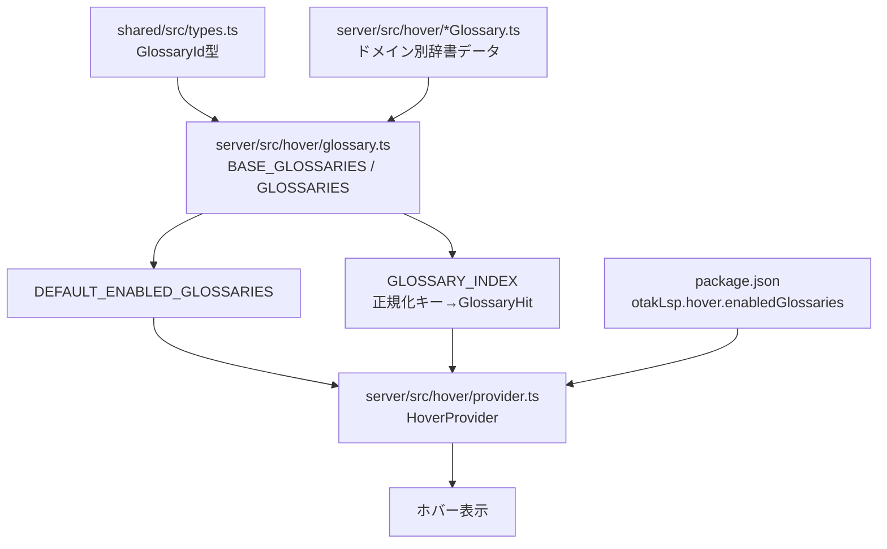
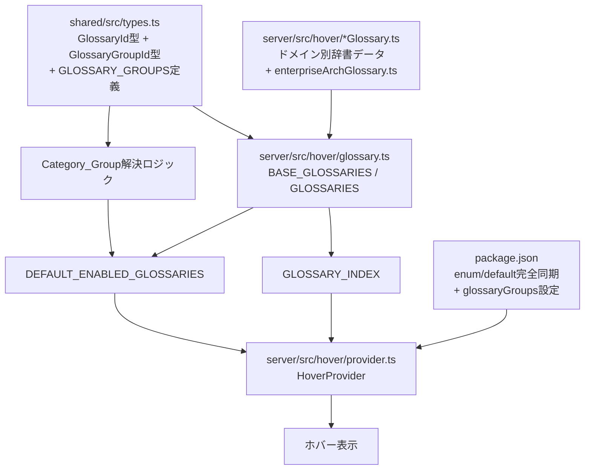

# 設計ドキュメント: 用語図鑑カテゴリ再整備

## 概要（Overview）

本設計は、otak-lspの用語図鑑（Glossary）システムにおけるカテゴリ管理の再整備を行う。現在50以上のカテゴリが存在するが、GlossaryIdとBASE_GLOSSARIESの不整合、package.jsonとの同期漏れ、上位カテゴリの欠如、命名規則の不統一、タイトル表記の混在、重複エントリの未管理、優先度制御の不透明さといった問題がある。

本設計では以下の7つの変更を行う:

1. `enterpriseArchGlossary.ts`をGlossary_Systemに正式登録する
2. package.jsonのenum/defaultにCLI系辞書16カテゴリ + enterpriseArchを追加する
3. Category_Group（カテゴリグループ）の型定義と実装を導入する
4. 既存GlossaryIdの命名規則を文書化する（後方互換のため既存IDは変更しない）
5. 辞書タイトルを「〇〇用語図鑑」形式に統一する
6. 重複エントリの検出テストを実装する
7. `createGlossaryRank`関数をCategory_Groupベースの優先度制御に拡張する

変更は既存のホバー機能に影響を与えないよう、後方互換性を維持しながら段階的に適用する。

## アーキテクチャ

### 現在のアーキテクチャ



### 変更後のアーキテクチャ



### 設計判断

1. **Category_Groupの定義場所**: `shared/src/types.ts`に配置する。クライアント（package.json設定）とサーバー（glossary.ts）の両方から参照されるため、共有層が適切。
2. **グループ設定のUI方式**: VS Codeの設定UIでは配列型（`enabledGlossaries`）に加え、新たに`enabledGlossaryGroups`配列を追加する。個別カテゴリ設定がグループ設定より優先される。
3. **後方互換性**: 既存のGlossaryIdは一切変更しない。新規追加（`enterpriseArch`）のみ行う。
4. **優先度制御**: `createGlossaryRank`をCategory_Groupの重み付けベースに拡張する。グループ内は登録順を維持する。

## コンポーネントとインターフェース

### 1. shared/src/types.ts（型定義の拡張）

```typescript
// 既存のGlossaryIdに'enterpriseArch'を追加
export type GlossaryId =
  | 'it'
  | 'otakLspSettings'
  // ... 既存のID ...
  | 'enterpriseArch';  // 新規追加

// カテゴリグループID
export type GlossaryGroupId =
  | 'infrastructure'
  | 'cloudServices'
  | 'languagesFrameworks'
  | 'packageManagersBuild'
  | 'databases'
  | 'versionControl'
  | 'designArchitecture'
  | 'securityAuth'
  | 'networkApi'
  | 'operationsMonitoring'
  | 'messaging'
  | 'aiMl'
  | 'projectManagement'
  | 'webDevelopment'
  | 'general';

// カテゴリグループ定義
export interface GlossaryGroupDefinition {
  readonly id: GlossaryGroupId;
  readonly label: string;        // 日本語表示名
  readonly members: ReadonlyArray<GlossaryId>;
  readonly priority: number;     // 小さいほど高優先度（0始まり）
}

// グループ定義の定数
export const GLOSSARY_GROUPS: ReadonlyArray<GlossaryGroupDefinition> = [
  { id: 'general', label: '一般', members: ['it', 'otakLspSettings'], priority: 0 },
  { id: 'webDevelopment', label: 'Web開発', members: ['backend', 'frontend'], priority: 1 },
  { id: 'designArchitecture', label: '設計・アーキテクチャ', members: ['ddd', 'tdd', 'architecturePatterns', 'distributedSystems', 'enterpriseArch'], priority: 2 },
  { id: 'languagesFrameworks', label: '開発言語・フレームワーク', members: ['java', 'javaCli', 'nextjs', 'dotnet', 'pip'], priority: 3 },
  { id: 'packageManagersBuild', label: 'パッケージマネージャ・ビルドツール', members: ['npm', 'yarn', 'pnpm', 'maven', 'gradle'], priority: 4 },
  { id: 'versionControl', label: 'バージョン管理', members: ['git'], priority: 5 },
  { id: 'databases', label: 'データベース', members: ['dbSqlTx', 'oracle', 'mysql'], priority: 6 },
  { id: 'securityAuth', label: 'セキュリティ・認証', members: ['security', 'authIam'], priority: 7 },
  { id: 'networkApi', label: 'ネットワーク・API', members: ['networkHttp', 'apiDesign'], priority: 8 },
  { id: 'operationsMonitoring', label: '運用・監視', members: ['devopsCicd', 'observabilitySre', 'performanceCache'], priority: 9 },
  { id: 'messaging', label: 'メッセージング', members: ['messagingEda'], priority: 10 },
  { id: 'aiMl', label: 'AI・機械学習', members: ['aiLlm'], priority: 11 },
  { id: 'projectManagement', label: 'プロジェクト管理・プロセス', members: ['pmbok', 'agileProduct', 'devProcess', 'ipaMetrics', 'contractLegal'], priority: 12 },
  { id: 'infrastructure', label: '基盤・インフラ', members: ['cloud', 'containersK8s', 'linux', 'windows', 'powershell', 'docker', 'iotEmbedded'], priority: 13 },
  { id: 'cloudServices', label: 'クラウドサービス', members: ['awsServices', 'azureServices', 'gcpServices', 'ociServices', 'cloudflareServices'], priority: 14 },
];
```

### 2. server/src/hover/glossary.ts（コア変更）

#### 2a. enterpriseArchGlossary.tsのインポートと登録

```typescript
import { ENTERPRISE_ARCH_GLOSSARY } from './enterpriseArchGlossary';

// BASE_GLOSSARIESに追加
{
  id: 'enterpriseArch',
  title: 'エンタープライズアーキテクチャ用語図鑑',
  entries: ENTERPRISE_ARCH_GLOSSARY as unknown as GlossaryEntry[],
},
```

#### 2b. createGlossaryRank関数の拡張

```typescript
export function createGlossaryRank(enabledGlossaries: ReadonlyArray<GlossaryId>): ReadonlyMap<GlossaryId, number> {
  // GLOSSARY_GROUPSのpriority順にグループをソートし、
  // グループ内はmembers配列の順序を維持する。
  // enabledGlossariesに含まれるもののみランクを付与する。
  const enabledSet = new Set(enabledGlossaries);
  const rank = new Map<GlossaryId, number>();
  let index = 0;

  // グループ定義のpriority順にソート済み（GLOSSARY_GROUPSは定義時にソート済み）
  for (const group of GLOSSARY_GROUPS) {
    for (const memberId of group.members) {
      if (enabledSet.has(memberId) && !rank.has(memberId)) {
        rank.set(memberId, index);
        index += 1;
      }
    }
  }

  // どのグループにも属さないカテゴリ（将来の拡張に備える）
  for (const id of enabledGlossaries) {
    if (!rank.has(id)) {
      rank.set(id, index);
      index += 1;
    }
  }

  return rank;
}
```

#### 2c. DEFAULT_ENABLED_GLOSSARIESの更新

```typescript
// 既存のPROVIDER_SERVICE_GLOSSARIESベースのソートを廃止し、
// createGlossaryRankと同じグループ優先度ベースに統一する
export const DEFAULT_ENABLED_GLOSSARIES: ReadonlyArray<GlossaryId> = (() => {
  const allIds = GLOSSARIES.map((g) => g.id);
  // createGlossaryRankの順序でソート
  const rank = createGlossaryRank(allIds);
  return [...allIds].sort((a, b) => (rank.get(a) ?? Infinity) - (rank.get(b) ?? Infinity));
})();
```

### 3. server/src/hover/provider.ts（グループ設定の統合）

```typescript
// 新しいメソッド追加
setEnabledGlossaryGroups(groups: GlossaryGroupId[]): void {
  // グループに属するカテゴリを展開して有効化
  const groupMembers = new Set<GlossaryId>();
  for (const groupId of groups) {
    const group = GLOSSARY_GROUPS.find(g => g.id === groupId);
    if (group) {
      for (const member of group.members) {
        groupMembers.add(member);
      }
    }
  }
  // 個別設定がグループ設定より優先される
  // → enabledGlossariesが明示的に設定されている場合はそちらを使用
  // → グループのみ指定の場合はグループ展開結果を使用
}
```

### 4. package.json（設定の完全同期）

```json
{
  "otakLsp.hover.enabledGlossaries": {
    "type": "array",
    "items": {
      "type": "string",
      "enum": [
        "it", "otakLspSettings", "cloud",
        "awsServices", "azureServices", "gcpServices", "ociServices", "cloudflareServices",
        "iotEmbedded", "backend", "frontend",
        "ddd", "tdd", "pmbok", "java", "nextjs", "dotnet",
        "security", "networkHttp", "authIam", "dbSqlTx", "apiDesign",
        "devopsCicd", "containersK8s", "observabilitySre", "distributedSystems",
        "messagingEda", "performanceCache", "architecturePatterns",
        "agileProduct", "aiLlm", "contractLegal",
        "git", "npm", "yarn", "pnpm", "pip",
        "docker", "linux", "windows", "powershell",
        "oracle", "mysql", "javaCli", "maven", "gradle",
        "devProcess", "ipaMetrics",
        "enterpriseArch"
      ]
    },
    "default": [
      "it", "otakLspSettings", "cloud",
      "backend", "frontend",
      "ddd", "tdd", "architecturePatterns", "distributedSystems", "enterpriseArch",
      "java", "javaCli", "nextjs", "dotnet", "pip",
      "npm", "yarn", "pnpm", "maven", "gradle",
      "git",
      "dbSqlTx", "oracle", "mysql",
      "security", "authIam",
      "networkHttp", "apiDesign",
      "devopsCicd", "observabilitySre", "performanceCache",
      "messagingEda",
      "aiLlm",
      "pmbok", "agileProduct", "devProcess", "ipaMetrics", "contractLegal",
      "iotEmbedded", "docker", "linux", "windows", "powershell", "containersK8s",
      "awsServices", "azureServices", "gcpServices", "ociServices", "cloudflareServices"
    ]
  },
  "otakLsp.hover.enabledGlossaryGroups": {
    "type": "array",
    "items": {
      "type": "string",
      "enum": [
        "general", "webDevelopment", "designArchitecture",
        "languagesFrameworks", "packageManagersBuild", "versionControl",
        "databases", "securityAuth", "networkApi",
        "operationsMonitoring", "messaging", "aiMl",
        "projectManagement", "infrastructure", "cloudServices"
      ]
    },
    "default": [
      "general", "webDevelopment", "designArchitecture",
      "languagesFrameworks", "packageManagersBuild", "versionControl",
      "databases", "securityAuth", "networkApi",
      "operationsMonitoring", "messaging", "aiMl",
      "projectManagement", "infrastructure", "cloudServices"
    ],
    "description": "ホバーで有効にする用語図鑑のカテゴリグループ。グループ単位で一括ON/OFFが可能。"
  }
}
```

### 5. Configuration型の拡張（shared/src/types.ts）

```typescript
export interface Configuration {
  // ... 既存フィールド ...
  hover: {
    enableWikipedia: boolean;
    enableGlossary: boolean;
    enabledGlossaries: GlossaryId[];
    enabledGlossaryGroups: GlossaryGroupId[];  // 新規追加
  };
}
```

## データモデル

### GlossaryGroupDefinition

| フィールド | 型 | 説明 |
|-----------|------|------|
| id | `GlossaryGroupId` | グループの一意識別子 |
| label | `string` | 日本語表示名（VS Code設定UIで使用） |
| members | `ReadonlyArray<GlossaryId>` | グループに属するカテゴリIDの配列 |
| priority | `number` | グループの優先度（0が最高、大きいほど低い） |

### グループ→カテゴリのマッピング

| グループID | 日本語名 | 優先度 | メンバー |
|-----------|---------|--------|---------|
| general | 一般 | 0 | it, otakLspSettings |
| webDevelopment | Web開発 | 1 | backend, frontend |
| designArchitecture | 設計・アーキテクチャ | 2 | ddd, tdd, architecturePatterns, distributedSystems, enterpriseArch |
| languagesFrameworks | 開発言語・フレームワーク | 3 | java, javaCli, nextjs, dotnet, pip |
| packageManagersBuild | パッケージマネージャ・ビルドツール | 4 | npm, yarn, pnpm, maven, gradle |
| versionControl | バージョン管理 | 5 | git |
| databases | データベース | 6 | dbSqlTx, oracle, mysql |
| securityAuth | セキュリティ・認証 | 7 | security, authIam |
| networkApi | ネットワーク・API | 8 | networkHttp, apiDesign |
| operationsMonitoring | 運用・監視 | 9 | devopsCicd, observabilitySre, performanceCache |
| messaging | メッセージング | 10 | messagingEda |
| aiMl | AI・機械学習 | 11 | aiLlm |
| projectManagement | プロジェクト管理・プロセス | 12 | pmbok, agileProduct, devProcess, ipaMetrics, contractLegal |
| infrastructure | 基盤・インフラ | 13 | cloud, containersK8s, linux, windows, powershell, docker, iotEmbedded |
| cloudServices | クラウドサービス | 14 | awsServices, azureServices, gcpServices, ociServices, cloudflareServices |

### 優先度の設計根拠

- 一般（0）: 最も汎用的な用語。どのドメインでも参照される
- Web開発〜AI（1-11）: 開発者が日常的に参照する技術ドメイン
- プロジェクト管理（12）: 技術用語より参照頻度が低い
- 基盤・インフラ（13）: CLI系コマンドは特定ユーザー向け
- クラウドサービス（14）: 最も低い優先度（現行動作の維持。プロバイダ固有の用語は汎用性が低い）

### 辞書タイトルの統一ルール

すべてのGlossaryDefinitionのtitleは以下の形式に統一する:

- 基本形: `〇〇用語図鑑`
- ドメイン名は日本語表記を優先（英語の正式名称がある場合は括弧で併記可）
- 例: `Git用語図鑑`、`エンタープライズアーキテクチャ用語図鑑`

現在の不統一箇所（確認済み）:
- `pip/Python用語図鑑` → `pip・Python用語図鑑`（スラッシュを中黒に統一）


## 正当性プロパティ（Correctness Properties）

*プロパティとは、システムの全ての有効な実行において成り立つべき特性や振る舞いのことである。人間が読める仕様と機械的に検証可能な正当性保証の橋渡しとなる。*

### Property 1: package.jsonとGlossaryIdの完全同期

*任意の*GlossaryIdに対して、そのIDはpackage.jsonの`otakLsp.hover.enabledGlossaries`のenum配列とdefault配列の両方に含まれなければならない。

**Validates: Requirements 2.1, 2.2**

### Property 2: グループ展開の完全性

*任意の*GlossaryGroupIdに対して、そのグループを有効化した場合、グループのmembers配列に含まれる全てのGlossaryIdが有効化されなければならない。

**Validates: Requirements 3.2**

### Property 3: 個別カテゴリ設定のグループ設定に対する優先

*任意の*GlossaryIdとGlossaryGroupIdの組み合わせに対して、個別カテゴリの有効/無効設定がグループの有効/無効設定より優先されなければならない。

**Validates: Requirements 3.3**

### Property 4: GlossaryIdの命名規則準拠

*任意の*GlossaryIdに対して、そのIDはcamelCase形式であり、サービス系カテゴリは`[プロバイダ]Services`の形式に従わなければならない。

**Validates: Requirements 4.1**

### Property 5: 辞書タイトルの形式統一

*任意の*GlossaryDefinitionに対して、そのtitleは「用語図鑑」で終わらなければならない。

**Validates: Requirements 5.1**

### Property 6: 重複エントリの優先度解決

*任意の*重複term（同一の正規化キーが複数のGlossaryDefinitionに存在する場合）と*任意の*glossaryRankに対して、`bestHitForCandidate`は最も低いランク値（最高優先度）を持つカテゴリのエントリを返さなければならない。

**Validates: Requirements 6.1**

### Property 7: グループ内カテゴリの登録順序保持

*任意の*GLOSSARY_GROUPSのグループに対して、`createGlossaryRank`が返すランクにおいて、グループのmembers配列内の順序が保持されなければならない（前のメンバーのランクは後のメンバーのランクより小さい）。

**Validates: Requirements 7.2**

## エラーハンドリング

### 1. 不正なGlossaryId

- **状況**: ユーザーがpackage.jsonの設定で存在しないGlossaryIdを指定した場合
- **対応**: `setEnabledGlossaries`で不正なIDをフィルタリングし、有効なIDのみを使用する。既存の動作を維持する。

### 2. 不正なGlossaryGroupId

- **状況**: ユーザーが存在しないGlossaryGroupIdを指定した場合
- **対応**: `setEnabledGlossaryGroups`で不正なグループIDを無視し、有効なグループのみを展開する。

### 3. グループとカテゴリの競合

- **状況**: グループで無効化されたカテゴリが個別に有効化されている場合
- **対応**: 個別カテゴリ設定を優先する（要件3.3）。具体的には、`enabledGlossaries`が明示的に設定されている場合はそちらを使用し、グループ設定は`enabledGlossaries`が未設定の場合のフォールバックとして機能する。

### 4. 空のグループ/カテゴリ設定

- **状況**: 全てのグループ/カテゴリが無効化された場合
- **対応**: 空のランクマップを返し、ホバーで用語図鑑を表示しない。既存の`glossaryEnabled`フラグとの整合性を維持する。

### 5. enterpriseArchGlossary.tsの型不整合

- **状況**: `CliGlossaryEntry`型と`GlossaryEntry`型の差異
- **対応**: 既存のCLI辞書と同様に`as unknown as GlossaryEntry[]`でキャストする（既存パターンの踏襲）。

## テスト戦略

### テストフレームワーク

- **単体テスト**: Jest
- **プロパティベーステスト**: fast-check（numRuns: 30）

### プロパティベーステスト

各正当性プロパティに対して1つのプロパティベーステストを実装する。

テストファイル: `server/src/hover/glossary.property.test.ts`

各テストには以下のタグ形式でコメントを付与する:
```
Feature: glossary-category-reorganization, Property {number}: {property_text}
```

#### Property 1: package.jsonとGlossaryIdの完全同期
- BASE_GLOSSARIESの全IDを取得し、package.jsonのenum/default配列と比較する
- fast-checkでBASE_GLOSSARIESからランダムにIDを選択し、enum/defaultに含まれることを検証する

#### Property 2: グループ展開の完全性
- fast-checkでランダムなGlossaryGroupIdの部分集合を生成し、展開結果が全メンバーを含むことを検証する

#### Property 3: 個別カテゴリ設定のグループ設定に対する優先
- fast-checkでランダムなグループ設定と個別カテゴリ設定を生成し、個別設定が優先されることを検証する

#### Property 4: GlossaryIdの命名規則準拠
- BASE_GLOSSARIESの全IDに対してcamelCase正規表現でマッチすることを検証する

#### Property 5: 辞書タイトルの形式統一
- BASE_GLOSSARIESの全GlossaryDefinitionのtitleが「用語図鑑」で終わることを検証する

#### Property 6: 重複エントリの優先度解決
- fast-checkでランダムなランク設定を生成し、重複termに対してbestHitForCandidateが最高優先度のエントリを返すことを検証する

#### Property 7: グループ内カテゴリの登録順序保持
- fast-checkでランダムなenabledGlossaries配列を生成し、createGlossaryRankの結果がグループ内順序を保持することを検証する

### 単体テスト

テストファイル: `server/src/hover/glossary.test.ts`（既存ファイルに追加）

#### 整合性テスト
- enterpriseArchがBASE_GLOSSARIESに登録されていることを確認する
- BASE_GLOSSARIESの全IDがGlossaryId型の値として有効であることを確認する
- GLOSSARY_GROUPSの全メンバーがGlossaryId型の値として有効であることを確認する
- GLOSSARY_GROUPSの全メンバーがBASE_GLOSSARIESに存在することを確認する

#### 重複検出テスト
- 全GlossaryDefinition間で重複するterm（正規化後）を検出し、レポートする
- 重複の存在自体はエラーではなく、意図的な重複を許容する（テスト出力で報告のみ）

#### createGlossaryRank テスト
- クラウドサービスグループのランクが他のグループより大きいことを確認する
- DEFAULT_ENABLED_GLOSSARIESの順序がグループ優先度に従うことを確認する

#### タイトル統一テスト
- 全GlossaryDefinitionのtitleが「用語図鑑」で終わることを確認する
