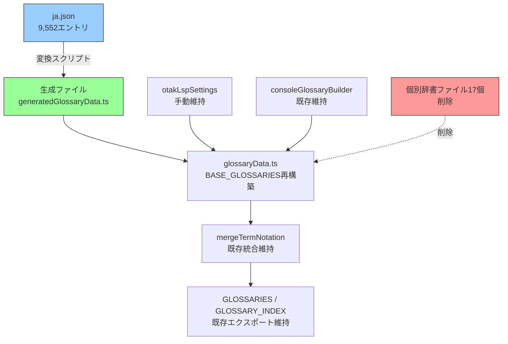
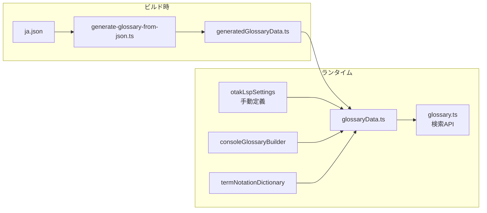
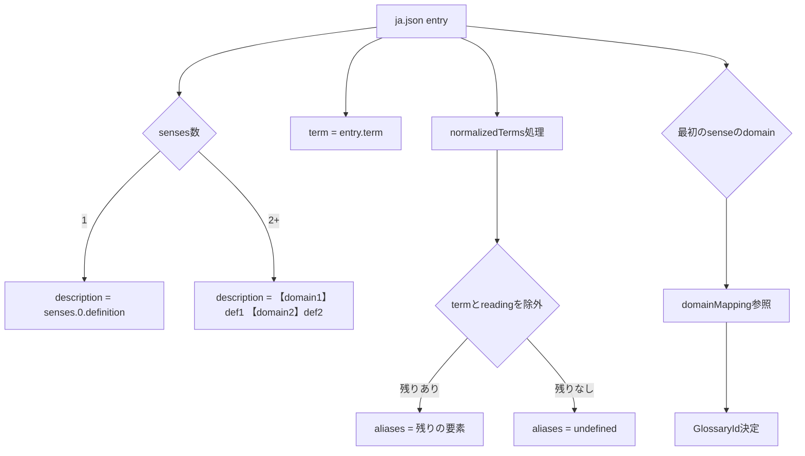

# 設計書: glossary-ja-json-rebuild

## 概要

otak-lspの用語図鑑（Glossary）システムにおいて、既存の手動定義された辞書データ（BASE_GLOSSARIES内のインラインエントリおよび17個の個別辞書ファイル）をすべて削除し、`ja.json`（9,552エントリ、226ドメイン）を唯一のデータソースとして辞書を再構築する。

### 設計方針

1. **ビルド時コード生成**: ja.jsonをランタイムで読み込むのではなく、変換スクリプトでTypeScriptソースコードを生成する
2. **既存インターフェース維持**: `glossary.ts`、`glossaryTypes.ts`、`glossaryUtils.ts`の公開APIは一切変更しない
3. **段階的統合**: 生成されたデータは既存の`glossaryData.ts`のBASE_GLOSSARIES構造に統合し、consoleGlossaryBuilder・termNotationDictionary統合の仕組みを維持する
4. **otakLspSettings維持**: ja.jsonに含まれないotak-lsp固有の設定用語カテゴリは手動定義のまま維持する

### 変更範囲



## アーキテクチャ

### コンポーネント構成



### データフロー

1. **ビルド時**: `scripts/generate-glossary-from-json.ts` が `ja.json` を読み込み、ドメインマッピングに基づいて `GlossaryId` ごとにグルーピングし、`server/src/hover/generatedGlossaryData.ts` を生成
2. **モジュール初期化時**: `glossaryData.ts` が生成ファイルをインポートし、`otakLspSettings`（手動定義）と結合してBASE_GLOSSARIESを構築
3. **統合**: 既存の `mergeTermNotationIntoGlossaries` → `GLOSSARIES` → `GLOSSARY_INDEX` のパイプラインはそのまま維持

## コンポーネントとインターフェース

### 1. 変換スクリプト (`scripts/generate-glossary-from-json.ts`)

ja.jsonを読み込み、TypeScriptソースコードを生成するNode.jsスクリプト。

```typescript
// 入力: ja.jsonのエントリ型
interface JaJsonEntry {
  term: string;
  reading: string;
  senses: Array<{
    definition: string;
    domain: string;
    normalizedDomain: string;
    normalizedKeywords: string[];
  }>;
  normalizedTerms: string[];
}

// ドメインマッピング型
type DomainMapping = Record<string, GlossaryId>;

// 変換関数のインターフェース
function convertJaJsonEntry(entry: JaJsonEntry, mapping: DomainMapping): {
  glossaryId: GlossaryId;
  entry: GlossaryEntry;
};
```

**責務**:
- ja.jsonの読み込みとパース
- 各エントリの `GlossaryEntry` への変換
- ドメインマッピングに基づく `GlossaryId` への振り分け
- TypeScriptソースコードの生成・出力
- 未知ドメインの警告出力とフォールバック処理

### 2. 生成ファイル (`server/src/hover/generatedGlossaryData.ts`)

変換スクリプトが出力するTypeScriptファイル。

```typescript
// 生成ファイルのエクスポート
export const GENERATED_GLOSSARY_DATA: ReadonlyArray<{
  id: GlossaryId;
  title: string;
  entries: ReadonlyArray<GlossaryEntry>;
}>;
```

**特徴**:
- 自動生成であることを示すヘッダコメント付き
- ドメインマッピング情報をコメントとして含む
- `GlossaryEntry[]` を `GlossaryId` ごとにグルーピングした配列

### 3. glossaryData.ts（変更）

既存のBASE_GLOSSARIES構造を維持しつつ、データソースを生成ファイルに切り替える。

**変更内容**:
- 個別辞書ファイルのインポートをすべて削除
- `GENERATED_GLOSSARY_DATA` をインポート
- BASE_GLOSSARIESの構築ロジックを変更:
  - `otakLspSettings`: 手動定義を維持
  - その他カテゴリ: `GENERATED_GLOSSARY_DATA` から取得
  - クラウドサービス系: 生成データ + consoleGlossaryBuilder の `mergeGlossaryEntries`
- `mergeTermNotationIntoGlossaries`、`GLOSSARIES`、`DEFAULT_ENABLED_GLOSSARIES`、`GLOSSARY_INDEX` のエクスポートは維持

### 4. ドメインマッピング定義

226ドメインを既存の `GlossaryId` にマッピングする対応表。変換スクリプト内に定義する。

**マッピング方針**:

| ja.jsonドメイン群 | マッピング先GlossaryId |
|---|---|
| `software-engineering`, `programming`, `testing`, `code-quality`, `development`, `development-practices`, `anti-patterns`, `it-vocabulary`, `it-basics`, `computer-basics`, `computer-architecture`, `documentation`, `writing`, `knowledge`, `knowledge-management`, `General`, `general`, `software`, `product`, `product-management`, `service`, `chat`, `data`, `data-analysis`, `data-integration`, `reporting`, `cross-cutting`, `maintainability`, `technology-selection`, `hardware`, `os`, `virtualization` | `it` |
| `cloud`, `Cloud`, `IaaS`, `PaaS`, `SaaS` | `cloud` |
| `aws`, `AWS` | `awsServices` |
| `azure`, `Azure` | `azureServices` |
| `google-cloud` | `gcpServices` |
| `oci`, `oci-apex`, `oracle-apex`, `apex` | `ociServices` |
| `backend`, `web-api`, `api` | `backend` |
| `frontend`, `css`, `html`, `react`, `javascript`, `typescript`, `web`, `web-analytics`, `mobile`, `ux-design`, `ui-design`, `ux`, `UX`, `ui_design`, `accessibility`, `Accessibility` | `frontend` |
| `ddd`, `DDD`, `modeling`, `design-patterns`, `Design Patterns`, `design-principles`, `design`, `Design`, `oop` | `ddd` |
| `tdd`, `pbt`, `Testing`, `hypothesis`, `jqwik`, `junit` | `tdd` |
| `project-management`, `Project Management`, `estimation`, `team`, `organization`, `Organizational Management`, `Organizational Culture`, `process-management`, `change-management`, `requirements`, `proposal`, `project_management` | `pmbok` |
| `java`, `spring`, `spring-boot` | `java` |
| `nextjs` | `nextjs` |
| `dotnet`, `visual-studio` | `dotnet` |
| `security`, `Security`, `compliance`, `Compliance`, `audit`, `Audit`, `governance`, `Governance`, `risk-management`, `Risk Management`, `incident-response`, `Incident Response` | `security` |
| `network`, `Network` | `networkHttp` |
| `authIam` (該当ドメインなし、既存エントリのみ) | `authIam` |
| `database`, `Database`, `sql`, `data-store`, `data-engineering` | `dbSqlTx` |
| `api-design` | `apiDesign` |
| `devops`, `ci-cd`, `CI/CD`, `version-control`, `release`, `build`, `dependency-management`, `Dependency Management` | `devopsCicd` |
| `container`, `kubernetes` | `containersK8s` |
| `sre`, `SRE`, `monitoring`, `Monitoring`, `observability`, `Observability`, `Operations Monitoring`, `logging`, `incident-response` | `observabilitySre` |
| `distributed-systems`, `Distributed Systems` | `distributedSystems` |
| `messaging` (該当ドメインなし) | `messagingEda` |
| `performance`, `Performance`, `capacity`, `Capacity` | `performanceCache` |
| `architecture`, `Architecture`, `design-document`, `Design Document` | `architecturePatterns` |
| `agile`, `Agile`, `methodology` | `agileProduct` |
| `ai`, `AI`, `machine-learning`, `llm`, `LLM`, `rag`, `RAG`, `agent`, `Agent`, `ai-integration`, `ai-dev` | `aiLlm` |
| `legal`, `finance`, `accounting`, `billing`, `trading`, `real-estate`, `labor`, `hr`, `international-business`, `sales-engineering`, `Sales`, `marketing`, `Marketing`, `manufacturing`, `sustainability`, `business`, `business-analysis`, `business-process`, `business-improvement`, `business-strategy`, `business-management`, `Business Strategy`, `Data Analytics`, `corporate-management`, `Corporate Operations` | `contractLegal` |
| `git`, `github`, `github-actions`, `github-codespaces`, `github-projects`, `svn` | `git` |
| `npm`, `package-management` | `npm` |
| `yarn` | `yarn` |
| `pnpm` | `pnpm` |
| `pip`, `python`, `postgresql` | `pip` |
| `docker` | `docker` |
| `linux`, `shell` | `linux` |
| `windows`, `powershell`, `vba` | `windows` |
| `powershell` (windowsに統合) | `powershell` |
| `oracle` | `oracle` |
| `mysql` | `mysql` |
| `maven` | `maven` |
| `gradle` | `gradle` |
| `vs-code` | `it` |
| `embedded`, `iot` | `iotEmbedded` |
| `operations`, `Operations`, `support` | `observabilitySre` |
| `enterprise`, `integration`, `migration`, `Migration` | `enterpriseArch` |
| `fe-dev-management`, `fe-security`, `fe-fundamentals`, `fe-architecture-os`, `fe-database`, `fe-network` | `frontend` |
| `storage` | `cloud` |
| `information-management` | `security` |
| `quality`, `quality-management`, `Code Quality` | `tdd` |
| `metrics`, `FinOps`, `finops` | `observabilitySre` |
| `Development`, `UML`, `uml` | `architecturePatterns` |
| `culture` | `agileProduct` |

**注意**: 上記マッピングは226ドメインすべてをカバーする。未知ドメインが出現した場合は `it` にフォールバックし、警告を出力する。

### 5. shared/src/types.ts（変更なし）

既存の `GlossaryId` 型と `GLOSSARY_GROUPS` は変更不要。226ドメインはすべて既存のGlossaryIdにマッピング可能であり、新しいGlossaryIdの追加は不要。

## データモデル

### ja.jsonエントリ → GlossaryEntry 変換ルール



### 変換の具体例

**入力（ja.json）**:
```json
{
  "term": "基本設計書",
  "reading": "きほんせっけいしょ",
  "senses": [{
    "definition": "システムの全体像...",
    "domain": "software-engineering",
    "normalizedDomain": "software-engineering",
    "normalizedKeywords": ["設計書", "システム"]
  }],
  "normalizedTerms": ["基本設計書", "きほんせっけいしょ", "basic design document"]
}
```

**出力（GlossaryEntry）**:
```typescript
{
  term: '基本設計書',
  aliases: ['basic design document'],  // "基本設計書"(=term)と"きほんせっけいしょ"(=reading)を除外
  description: 'システムの全体像...',
}
// → GlossaryId: 'it' (software-engineeringのマッピング先)
```

**複数sense入力**:
```json
{
  "term": "リクエスト",
  "reading": "りくえすと",
  "senses": [
    { "definition": "APIに送る要求データ...", "domain": "backend" },
    { "definition": "ユーザーが求めること...", "domain": "product" }
  ],
  "normalizedTerms": ["リクエスト", "りくえすと", "request"]
}
```

**出力**:
```typescript
{
  term: 'リクエスト',
  aliases: ['request'],
  description: '【バックエンド】APIに送る要求データ... 【プロダクト】ユーザーが求めること...',
}
// → GlossaryId: 'backend' (最初のsenseのdomainで決定)
```

### 生成ファイルの構造

```typescript
// server/src/hover/generatedGlossaryData.ts
// このファイルは自動生成です。手動で編集しないでください。
// 生成元: ja.json (9,552エントリ, 226ドメイン)
// 生成コマンド: npx ts-node scripts/generate-glossary-from-json.ts

import { GlossaryId } from '../../../shared/src/types';
import { GlossaryEntry } from './glossaryTypes';

export interface GeneratedGlossaryCategory {
  readonly id: GlossaryId;
  readonly title: string;
  readonly entries: ReadonlyArray<GlossaryEntry>;
}

export const GENERATED_GLOSSARY_DATA: ReadonlyArray<GeneratedGlossaryCategory> = [
  {
    id: 'it',
    title: 'IT用語図鑑',
    entries: [
      // software-engineering (447), programming (223), testing (175), ...
      { term: '基本設計書', aliases: ['basic design document'], description: '...' },
      // ...
    ],
  },
  // ... 他のカテゴリ
];
```

### glossaryData.tsの変更後構造

```typescript
// glossaryData.ts（変更後）
import { GENERATED_GLOSSARY_DATA } from './generatedGlossaryData';

// otakLspSettings は手動定義を維持
const OTAK_LSP_SETTINGS_ENTRIES: ReadonlyArray<GlossaryEntry> = [
  { term: 'otakLsp.enableGrammarCheck', ... },
  // ...
];

// BASE_GLOSSARIESの構築
const BASE_GLOSSARIES: ReadonlyArray<GlossaryDefinition> = (() => {
  const result: GlossaryDefinition[] = [];
  
  // 生成データからカテゴリを構築
  for (const category of GENERATED_GLOSSARY_DATA) {
    let entries: GlossaryEntry[] = [...category.entries];
    
    // クラウドサービス系はconsoleGlossaryBuilderと統合
    if (category.id === 'awsServices') {
      entries = mergeGlossaryEntries(entries, buildAwsConsoleGlossaryEntries());
    }
    // ... 他のクラウドサービスも同様
    
    result.push({ id: category.id, title: category.title, entries });
  }
  
  // otakLspSettingsを追加
  result.push({
    id: 'otakLspSettings',
    title: 'otak-lsp設定用語図鑑',
    entries: OTAK_LSP_SETTINGS_ENTRIES,
  });
  
  return result;
})();
```


## 正確性プロパティ (Correctness Properties)

*プロパティとは、システムのすべての有効な実行において成り立つべき特性や振る舞いのことです。人間が読める仕様と機械で検証可能な正確性保証の橋渡しとなります。*

### Property 1: エントリ変換のaliases生成正確性

*For any* ja.jsonエントリについて、`convertJaJsonEntry` で変換した結果の `aliases` は、元の `normalizedTerms` から `term` と完全一致する要素および `reading` と完全一致する要素を除外した残りと一致し、残りが空の場合は `undefined` である。また、変換結果の `term` は元の `term` と一致する。

**Validates: Requirements 1.1, 1.2, 1.5, 1.6**

### Property 2: description生成の正確性

*For any* ja.jsonエントリについて、senseが1つの場合は `description` が `senses[0].definition` と一致し、senseが2つ以上の場合は `description` が各senseの `definition` をドメイン日本語ラベル付き（`【ラベル】`形式）で結合した文字列と一致する。

**Validates: Requirements 1.3, 1.4, 6.6, 7.4**

### Property 3: ドメインマッピングの1対1制約

*For any* ドメイン名について、ドメインマッピングテーブル内でそのドメインに対応する `GlossaryId` は一意に1つだけ存在する（`Record<string, GlossaryId>` 型の構造的保証）。

**Validates: Requirements 2.5**

### Property 4: 最初のsenseによるカテゴリ決定

*For any* 複数senseを持つja.jsonエントリについて、`convertJaJsonEntry` で決定される `GlossaryId` は、最初のsense（`senses[0]`）の `domain` をドメインマッピングで変換した結果と一致する。

**Validates: Requirements 2.6**

### Property 5: 未知ドメインのフォールバック

*For any* ドメインマッピングテーブルに存在しないドメイン名を持つja.jsonエントリについて、`convertJaJsonEntry` は `GlossaryId` として `'it'` を返す。

**Validates: Requirements 6.4**

### Property 6: GLOSSARY_INDEXラウンドトリップ

*For any* `GLOSSARIES` 内の `GlossaryEntry` について、`normalizeKey(entry.term)` で `GLOSSARY_INDEX` を検索した結果は、当該エントリの `term` と `description` を含む `GlossaryHit` を少なくとも1つ含む。

**Validates: Requirements 4.4, 7.3, 7.5**

### Property 7: 全カテゴリのエントリ存在

*For any* `GlossaryId` について、`getGlossaryDefinitions()` の結果に当該カテゴリが含まれ、その `entryCount` は0より大きい。

**Validates: Requirements 7.2, 7.6**

## エラーハンドリング

### 変換スクリプトのエラーハンドリング

| エラー状況 | 対応 |
|---|---|
| ja.jsonが存在しない | エラーメッセージを出力して終了（exit code 1） |
| ja.jsonのパースエラー | エラーメッセージを出力して終了（exit code 1） |
| 未知のドメイン | 警告メッセージを標準エラーに出力し、`it` にフォールバック。処理は継続 |
| エントリにtermがない | 警告メッセージを出力してスキップ |
| エントリにsensesがない/空 | 警告メッセージを出力してスキップ |
| 出力ファイルの書き込みエラー | エラーメッセージを出力して終了（exit code 1） |

### ランタイムのエラーハンドリング

生成ファイルはTypeScriptソースコードとして静的に埋め込まれるため、ランタイムでのja.json読み込みエラーは発生しない。型安全性はTypeScriptコンパイラが保証する。

## テスト戦略

### テストアプローチ

単体テストとプロパティベーステストの二本立てで品質を保証する。

### プロパティベーステスト

- **ライブラリ**: fast-check
- **実行回数**: 30回（`numRuns: 30`）
- **ファイル**: `server/src/hover/glossaryData.property.test.ts`（統合プロパティ）、`scripts/generate-glossary-from-json.property.test.ts`（変換ロジック）

各プロパティテストは設計書のプロパティを参照するコメントを含む:
```typescript
// Feature: glossary-ja-json-rebuild, Property 1: エントリ変換のaliases生成正確性
```

**プロパティテスト一覧**:

| Property | テスト内容 | ファイル |
|---|---|---|
| Property 1 | ランダムなja.jsonエントリを生成し、aliases変換の正確性を検証 | `scripts/generate-glossary-from-json.property.test.ts` |
| Property 2 | ランダムなsense数のエントリを生成し、description生成を検証 | `scripts/generate-glossary-from-json.property.test.ts` |
| Property 3 | ドメインマッピングテーブルの1対1制約を検証 | `scripts/generate-glossary-from-json.property.test.ts` |
| Property 4 | 複数senseエントリのカテゴリ決定ロジックを検証 | `scripts/generate-glossary-from-json.property.test.ts` |
| Property 5 | 未知ドメインのフォールバック動作を検証 | `scripts/generate-glossary-from-json.property.test.ts` |
| Property 6 | GLOSSARY_INDEXのラウンドトリップ検索を検証 | `server/src/hover/glossaryData.property.test.ts` |
| Property 7 | 全カテゴリのエントリ存在を検証 | `server/src/hover/glossaryData.property.test.ts` |

### 単体テスト

- **ファイル**: `scripts/generate-glossary-from-json.test.ts`、`server/src/hover/glossaryData.test.ts`

**単体テスト一覧**:

| テスト | 内容 | 対応要件 |
|---|---|---|
| otakLspSettingsカテゴリの維持 | otakLspSettingsにエントリが存在することを確認 | 3.3 |
| consoleGlossaryBuilder統合 | AWSサービス等にconsoleGlossaryBuilder由来のエントリが含まれることを確認 | 3.4, 4.3 |
| termNotation統合の維持 | mergeTermNotationIntoGlossaries後のエントリが正しいことを確認 | 3.5 |
| 全ドメインカバレッジ | ja.jsonの226ドメインがすべてマッピングに存在することを確認 | 2.1 |
| 空aliasesのundefined化 | normalizedTermsがtermとreadingのみの場合にaliasesがundefinedになることを確認 | 1.6 |
| 全エントリのインデックス登録 | ja.jsonの全エントリがGLOSSARY_INDEXから検索可能であることを確認 | 4.5, 7.1 |

### テスト実行

```bash
# 全テスト実行
npm test

# 変換スクリプトのテストのみ
npx jest scripts/generate-glossary-from-json

# glossaryDataのテストのみ
npx jest server/src/hover/glossaryData
```
