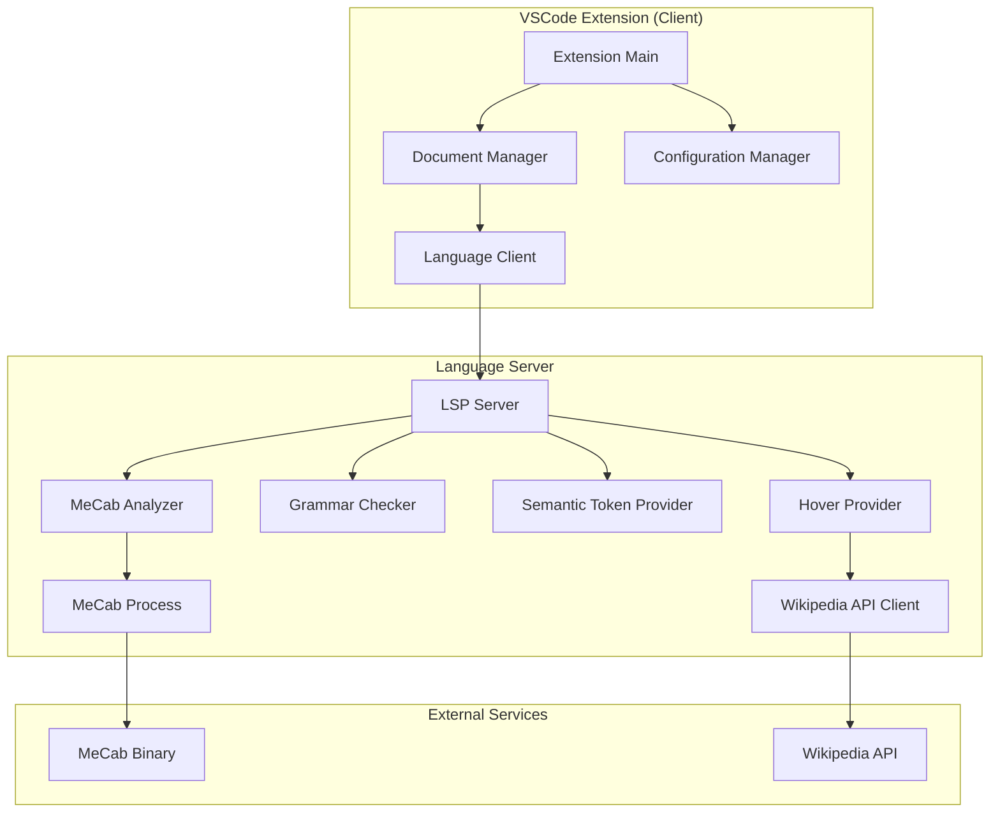

# 設計書

## 概要

本システムは、VSCode拡張機能として実装され、MeCabを使用した日本語形態素解析機能を提供する。Language Server Protocol (LSP) アーキテクチャを採用し、クライアント（VSCode拡張）とサーバー（解析エンジン）を分離することで、保守性と拡張性を確保する。

主要機能：
- MeCabによる形態素解析とトークン化
- プログラミング言語コメント内の日本語解析
- 文法エラー検出（二重助詞、助詞連続、動詞-助詞不整合）
- 品詞ベースのセマンティックハイライト
- ホバー情報表示（原形、読み、品詞、Wikipedia サマリー）

## アーキテクチャ

### システム構成



### レイヤー構造

1. **プレゼンテーション層（VSCode Extension）**
   - ユーザーインターフェース
   - 設定管理
   - ドキュメントイベント処理

2. **アプリケーション層（Language Server）**
   - LSPプロトコル実装
   - リクエスト/レスポンス処理
   - キャッシング戦略

3. **ドメイン層**
   - 形態素解析ロジック
   - 文法チェックルール
   - トークン分類

4. **インフラストラクチャ層**
   - MeCabプロセス管理
   - Wikipedia API通信
   - ファイルシステムアクセス

## コンポーネントとインターフェース

### 1. Extension Main (client/src/extension.ts)

拡張機能のエントリーポイント。

```typescript
interface ExtensionContext {
  activate(context: vscode.ExtensionContext): void;
  deactivate(): Thenable<void> | undefined;
}

interface LanguageClientOptions {
  documentSelector: DocumentFilter[];
  synchronize: {
    configurationSection: string;
    fileEvents: FileSystemWatcher;
  };
}
```

### 2. MeCab Analyzer (server/src/mecab/analyzer.ts)

MeCabとの通信を管理し、形態素解析を実行する。

```typescript
interface MeCabAnalyzer {
  analyze(text: string): Promise<Token[]>;
  isAvailable(): Promise<boolean>;
  getVersion(): Promise<string>;
}

interface Token {
  surface: string;      // 表層形
  pos: string;          // 品詞
  posDetail1: string;   // 品詞細分類1
  posDetail2: string;   // 品詞細分類2
  posDetail3: string;   // 品詞細分類3
  conjugation: string;  // 活用型
  conjugationForm: string; // 活用形
  baseForm: string;     // 原形
  reading: string;      // 読み
  pronunciation: string; // 発音
  start: number;        // 開始位置
  end: number;          // 終了位置
}
```

### 3. Comment Extractor (server/src/parser/commentExtractor.ts)

プログラミング言語のコメントを抽出する。

```typescript
interface CommentExtractor {
  extract(text: string, languageId: string): CommentRange[];
}

interface CommentRange {
  start: number;
  end: number;
  text: string;
  type: 'line' | 'block';
}

type SupportedLanguage = 'c' | 'cpp' | 'java' | 'python' | 'javascript' | 'typescript' | 'rust' | 'markdown';
```

### 4. Grammar Checker (server/src/grammar/checker.ts)

文法エラーを検出する。

```typescript
interface GrammarChecker {
  check(tokens: Token[]): Diagnostic[];
}

interface Diagnostic {
  range: Range;
  severity: DiagnosticSeverity;
  message: string;
  code: string;
  source: string;
  relatedInformation?: DiagnosticRelatedInformation[];
}

interface GrammarRule {
  name: string;
  check(tokens: Token[], index: number): Diagnostic | null;
}
```

### 5. Semantic Token Provider (server/src/semantic/tokenProvider.ts)

セマンティックトークン情報を提供する。

```typescript
interface SemanticTokenProvider {
  provideSemanticTokens(document: TextDocument): SemanticTokens;
}

interface SemanticTokens {
  data: number[]; // [line, char, length, tokenType, tokenModifiers]
}

enum TokenType {
  Noun = 0,
  Verb = 1,
  Adjective = 2,
  Particle = 3,
  Adverb = 4,
  Other = 5
}
```

### 6. Hover Provider (server/src/hover/provider.ts)

ホバー情報を提供する。

```typescript
interface HoverProvider {
  provideHover(document: TextDocument, position: Position): Promise<Hover | null>;
}

interface Hover {
  contents: MarkupContent;
  range?: Range;
}

interface WikipediaClient {
  getSummary(term: string): Promise<string | null>;
}
```

### 7. Configuration Manager (client/src/configuration.ts)

設定を管理する。

```typescript
interface Configuration {
  mecabPath: string;
  enableGrammarCheck: boolean;
  enableSemanticHighlight: boolean;
  targetLanguages: SupportedLanguage[];
  debounceDelay: number;
}

interface ConfigurationManager {
  get(): Configuration;
  update(key: string, value: any): Promise<void>;
  onDidChange(listener: (config: Configuration) => void): Disposable;
}
```

## データモデル

### Token（形態素トークン）

```typescript
class Token {
  surface: string;
  pos: string;
  posDetail1: string;
  posDetail2: string;
  posDetail3: string;
  conjugation: string;
  conjugationForm: string;
  baseForm: string;
  reading: string;
  pronunciation: string;
  start: number;
  end: number;

  isParticle(): boolean;
  isVerb(): boolean;
  isNoun(): boolean;
  isAdjective(): boolean;
}
```

### DocumentAnalysis（ドキュメント解析結果）

```typescript
class DocumentAnalysis {
  uri: string;
  version: number;
  tokens: Token[];
  diagnostics: Diagnostic[];
  semanticTokens: SemanticTokens;
  timestamp: number;

  isStale(currentVersion: number): boolean;
}
```

### GrammarError（文法エラー）

```typescript
class GrammarError {
  type: 'double-particle' | 'particle-sequence' | 'verb-particle-mismatch';
  tokens: Token[];
  range: Range;
  message: string;
  suggestion?: string;

  toDiagnostic(): Diagnostic;
}
```


## 正確性プロパティ

*プロパティとは、システムのすべての有効な実行において真であるべき特性または動作です。本質的には、システムが何をすべきかについての形式的な記述です。プロパティは、人間が読める仕様と機械で検証可能な正確性保証との橋渡しとなります。*

### プロパティ 1: トークン化の完全性

*任意の* 日本語テキストに対して、MeCabによるトークン化を実行したとき、結果のトークンリストは空でなく、すべてのトークンの表層形を連結すると元のテキストと一致する

**検証: 要件 1.1**

### プロパティ 2: トークン情報の完全性

*任意の* 日本語テキストに対して、形態素解析を実行したとき、すべてのトークンは品詞情報、原形、読みを持つ

**検証: 要件 1.2, 1.3**

### プロパティ 3: テキスト更新時の再解析

*任意の* ドキュメントに対して、テキストが更新されたとき、システムは新しいバージョンに対して解析を実行し、結果を更新する

**検証: 要件 1.4**

### プロパティ 4: コメント抽出の正確性

*任意の* サポートされているプログラミング言語のソースコードに対して、コメント抽出を実行したとき、抽出されたすべての範囲はその言語のコメント構文に一致し、コメント外のコードは含まれない。Markdownファイルの場合は、ファイル全体が解析対象となる

**検証: 要件 2.1, 2.2, 2.3, 2.4, 2.5**

### プロパティ 5: 二重助詞の検出

*任意の* トークンリストに対して、同じ助詞が連続して出現する場合、システムは該当箇所に診断情報を生成する

**検証: 要件 3.1**

### プロパティ 6: 助詞連続の検出

*任意の* トークンリストに対して、不適切な助詞の連続が出現する場合、システムは該当箇所に診断情報を生成する

**検証: 要件 3.2**

### プロパティ 7: 動詞-助詞不整合の検出

*任意の* トークンリストに対して、動詞と後続する助詞の組み合わせが不自然な場合、システムは該当箇所に診断情報を生成する

**検証: 要件 3.3**

### プロパティ 8: 診断情報の完全性

*任意の* 文法エラーに対して、生成される診断情報はエラーの種類、説明、範囲を含み、可能な場合は修正候補を含む

**検証: 要件 3.4, 3.5**

### プロパティ 9: セマンティックトークンの生成

*任意の* 日本語テキストに対して、形態素解析を実行したとき、すべてのトークンは品詞に応じたセマンティックトークンタイプにマッピングされる

**検証: 要件 4.1, 4.2, 4.3, 4.4**

### プロパティ 10: ホバー情報の形態素データ

*任意の* ドキュメント内の位置に対して、その位置にトークンが存在する場合、ホバー情報は原形、読み、品詞情報を含む

**検証: 要件 5.1, 5.2, 5.3**

### プロパティ 11: Wikipedia統合

*任意の* 単語に対して、Wikipedia APIが利用可能な場合、ホバー情報はサマリーを含み、利用できない場合は形態素情報のみを含む

**検証: 要件 5.4, 5.5**

### プロパティ 12: 設定変更の反映

*任意の* 設定項目に対して、値が変更されたとき、システムは新しい設定値に基づいて動作を更新する

**検証: 要件 6.5**

### プロパティ 13: 複数ファイルの独立性

*任意の* 複数のドキュメントに対して、各ドキュメントの解析結果は他のドキュメントの内容や解析結果に影響されない

**検証: 要件 7.3**

### プロパティ 14: エラーログと通知

*任意の* 解析エラーに対して、システムはエラーをログに記録し、ユーザーに通知を表示する

**検証: 要件 7.5**

### プロパティ 15: MeCabパス検証

*任意の* MeCabパス設定に対して、システムはパスの有効性を検証し、無効な場合はエラーを返す

**検証: 要件 8.5**

## エラーハンドリング

### MeCab関連エラー

1. **MeCabが見つからない**
   - エラーコード: `MECAB_NOT_FOUND`
   - 処理: インストール手順を含むエラーメッセージを表示
   - リカバリ: ユーザーがMeCabをインストールし、パスを設定するまで機能を無効化

2. **MeCab辞書が見つからない**
   - エラーコード: `MECAB_DICT_NOT_FOUND`
   - 処理: 辞書のインストール手順を表示
   - リカバリ: 辞書がインストールされるまで機能を無効化

3. **MeCabプロセスエラー**
   - エラーコード: `MECAB_PROCESS_ERROR`
   - 処理: エラーをログに記録し、該当ドキュメントの解析をスキップ
   - リカバリ: 次回の編集時に再試行

4. **MeCab出力パースエラー**
   - エラーコード: `MECAB_PARSE_ERROR`
   - 処理: エラーをログに記録し、部分的な結果を返す
   - リカバリ: 次回の編集時に再試行

### Wikipedia API関連エラー

1. **APIリクエスト失敗**
   - エラーコード: `WIKIPEDIA_REQUEST_FAILED`
   - 処理: 形態素情報のみを表示
   - リカバリ: 次回のホバー時に再試行

2. **APIタイムアウト**
   - エラーコード: `WIKIPEDIA_TIMEOUT`
   - 処理: 形態素情報のみを表示
   - リカバリ: タイムアウト値を増やすか、キャッシュを使用

3. **レート制限**
   - エラーコード: `WIKIPEDIA_RATE_LIMIT`
   - 処理: キャッシュされた結果を使用、なければ形態素情報のみ
   - リカバリ: 指数バックオフで再試行

### ドキュメント処理エラー

1. **エンコーディングエラー**
   - エラーコード: `ENCODING_ERROR`
   - 処理: UTF-8として再試行、失敗したらエラー通知
   - リカバリ: ユーザーにエンコーディング変更を促す

2. **ファイルサイズ超過**
   - エラーコード: `FILE_TOO_LARGE`
   - 処理: 警告を表示し、部分的な解析を実行
   - リカバリ: 設定で最大ファイルサイズを調整可能

3. **コメント抽出エラー**
   - エラーコード: `COMMENT_EXTRACTION_ERROR`
   - 処理: エラーをログに記録し、ファイル全体を解析対象とする
   - リカバリ: 次回の編集時に再試行

### エラーハンドリング戦略

```typescript
class ErrorHandler {
  private retryCount: Map<string, number> = new Map();
  private maxRetries = 3;
  private backoffMs = 1000;

  async handleError(error: Error, context: ErrorContext): Promise<void> {
    // ログ記録
    this.logError(error, context);

    // リトライ可能なエラーの場合
    if (this.isRetryable(error)) {
      const key = this.getRetryKey(context);
      const count = this.retryCount.get(key) || 0;

      if (count < this.maxRetries) {
        this.retryCount.set(key, count + 1);
        await this.delay(this.backoffMs * Math.pow(2, count));
        return; // リトライを試みる
      }
    }

    // ユーザー通知
    this.notifyUser(error, context);

    // リカバリ処理
    await this.recover(error, context);
  }

  private isRetryable(error: Error): boolean {
    const retryableCodes = [
      'MECAB_PROCESS_ERROR',
      'WIKIPEDIA_REQUEST_FAILED',
      'WIKIPEDIA_TIMEOUT'
    ];
    return retryableCodes.includes((error as any).code);
  }
}
```

## テスト戦略

### 二重テストアプローチ

本システムでは、ユニットテストとプロパティベーステストの両方を使用します：

- **ユニットテスト**: 特定の例、エッジケース、エラー条件を検証
- **プロパティベーステスト**: すべての入力にわたって保持されるべき普遍的なプロパティを検証

両者は補完的であり、包括的なカバレッジを提供します。ユニットテストは具体的なバグを捕捉し、プロパティテストは一般的な正確性を検証します。

### ユニットテスト

**対象:**
- 特定の日本語テキストの解析結果
- 既知の文法エラーパターン
- エラー条件（MeCab未インストール、API障害など）
- 設定の読み書き
- コメント抽出の境界ケース

**ツール:** Jest

**例:**
```typescript
describe('GrammarChecker', () => {
  it('should detect double particle "がが"', () => {
    const tokens = parseText('私がが行く');
    const diagnostics = checker.check(tokens);
    expect(diagnostics).toHaveLength(1);
    expect(diagnostics[0].code).toBe('double-particle');
  });

  it('should handle empty text', () => {
    const tokens = parseText('');
    const diagnostics = checker.check(tokens);
    expect(diagnostics).toHaveLength(0);
  });
});
```

### プロパティベーステスト

**対象:**
- トークン化の完全性（すべてのテキストに対して）
- セマンティックトークンの生成（すべての品詞に対して）
- ホバー情報の完全性（すべての位置に対して）
- 文法チェックの一貫性（すべてのエラーパターンに対して）

**ツール:** fast-check（TypeScript用プロパティベーステストライブラリ）

**設定:**
- 各プロパティテストは最低100回の反復を実行
- 各プロパティテストは設計書の正確性プロパティを明示的に参照
- タグ形式: `**Feature: japanese-grammar-analyzer, Property {number}: {property_text}**`

**例:**
```typescript
import * as fc from 'fast-check';

describe('Property-Based Tests', () => {
  /**
   * Feature: japanese-grammar-analyzer, Property 1: トークン化の完全性
   */
  it('tokenization completeness', () => {
    fc.assert(
      fc.property(
        fc.string().filter(s => /[\u3040-\u309F\u30A0-\u30FF\u4E00-\u9FAF]/.test(s)),
        (text) => {
          const tokens = analyzer.analyze(text);
          expect(tokens.length).toBeGreaterThan(0);
          const reconstructed = tokens.map(t => t.surface).join('');
          expect(reconstructed).toBe(text);
        }
      ),
      { numRuns: 100 }
    );
  });

  /**
   * Feature: japanese-grammar-analyzer, Property 2: トークン情報の完全性
   */
  it('token information completeness', () => {
    fc.assert(
      fc.property(
        fc.string().filter(s => /[\u3040-\u309F\u30A0-\u30FF\u4E00-\u9FAF]/.test(s)),
        (text) => {
          const tokens = analyzer.analyze(text);
          tokens.forEach(token => {
            expect(token.pos).toBeDefined();
            expect(token.baseForm).toBeDefined();
            expect(token.reading).toBeDefined();
          });
        }
      ),
      { numRuns: 100 }
    );
  });
});
```

### 統合テスト

**対象:**
- Language Serverとクライアント間の通信
- MeCabプロセスとの統合
- Wikipedia APIとの統合
- VSCode拡張機能のライフサイクル

**ツール:** VSCode Extension Test Runner

### パフォーマンステスト

**対象:**
- 大きなファイルの解析時間
- メモリ使用量
- 複数ファイルの同時解析

**基準:**
- 1000行のファイル: 1秒以内
- メモリ使用量: 100MB以下
- デバウンス遅延: 500ms

## 実装の考慮事項

### キャッシング戦略

1. **解析結果のキャッシュ**
   - ドキュメントURIとバージョンをキーとする
   - LRUキャッシュで最大100ドキュメント
   - ドキュメントが閉じられたらキャッシュをクリア

2. **Wikipedia結果のキャッシュ**
   - 単語の原形をキーとする
   - メモリキャッシュ（最大1000エントリ）
   - TTL: 24時間

### パフォーマンス最適化

1. **デバウンス処理**
   - テキスト編集後500msで解析を開始
   - 連続した編集は最後の編集のみ処理

2. **インクリメンタル解析**
   - 変更された行とその前後のみ再解析
   - 変更されていない部分はキャッシュを使用

3. **並列処理**
   - 複数ファイルの解析は並列実行
   - Worker threadでMeCabプロセスを管理

### セキュリティ考慮事項

1. **MeCabパス検証**
   - ユーザー指定のパスはサニタイズ
   - 実行可能ファイルの存在と権限を確認

2. **Wikipedia API**
   - HTTPSのみ使用
   - レート制限を遵守
   - タイムアウトを設定（5秒）

3. **入力検証**
   - ファイルサイズ制限（10MB）
   - エンコーディング検証

## 依存関係

### 必須依存関係

- **MeCab**: 形態素解析エンジン（外部バイナリ）
- **vscode**: VSCode拡張API
- **vscode-languageclient**: LSPクライアント実装
- **vscode-languageserver**: LSPサーバー実装

### 開発依存関係

- **TypeScript**: 型安全な開発
- **Jest**: ユニットテストフレームワーク
- **fast-check**: プロパティベーステストライブラリ
- **ESLint**: コード品質チェック
- **Prettier**: コードフォーマット

### オプション依存関係

- **Wikipedia API**: ホバー情報の拡張（オンライン接続が必要）

## デプロイメント

### パッケージング

- VSCode拡張として`.vsix`ファイルを生成
- Language Serverはバンドルに含める
- MeCabは含めない（ユーザーが個別にインストール）

### インストール要件

1. VSCode 1.60.0以上
2. MeCab（システムにインストール済み）
3. Node.js 14以上（開発時のみ）

### 配布

- Visual Studio Code Marketplace
- GitHub Releases
- 手動インストール（.vsixファイル）