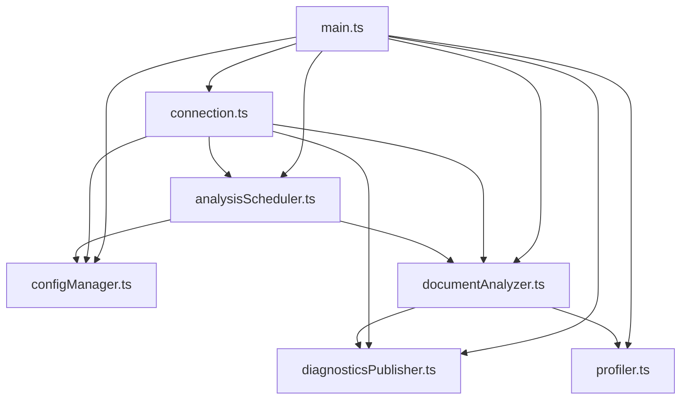

# Design Document: main.ts Refactoring

## Overview

`server/src/main.ts`（1365行）をMCPパターンを参考に、責務ごとに分離した複数のモジュールに分割する。各モジュールは300行未満とし、単一責任の原則に従う。

## Architecture

### 現状の問題点

現在の`main.ts`は以下の責務が混在している：
- LSP接続の初期化とハンドラ登録
- 設定の読み込みと適用
- 解析スケジューリング（デバウンス、段階実行）
- 文書解析（形態素解析、文法チェック、セマンティックトークン）
- 診断結果の送信
- プロファイリング

### 分割後の構造

```
server/src/
  main.ts                      # エントリーポイント（~80行）
  server/
    languageServer.ts          # 既存（AnalysisStateManager）
    connection.ts              # LSP接続・ハンドラ登録（~150行）
    configManager.ts           # 設定管理（~200行）
    analysisScheduler.ts       # 解析スケジューリング（~180行）
    documentAnalyzer.ts        # 文書解析ロジック（~280行）
    diagnosticsPublisher.ts    # 診断結果の発行（~80行）
    profiler.ts                # プロファイリング（~100行）
```

### 依存関係図



## Components and Interfaces

### 1. profiler.ts

プロファイリングとログ出力を担当。

```typescript
export interface ProfileStep {
  name: string;
  ms: number;
  meta?: string;
}

export interface Profiler {
  isEnabled(): boolean;
  recordStep(name: string, startTime: number, meta?: string): void;
  logBlock(title: string, headerMeta: string, steps: ProfileStep[], totalMs: number): void;
  logRuleProfilingBlock(uri: string, version: number, collector: RuleProfilingCollector): void;
}

export function createProfiler(
  logger: (message: string) => void,
  isEnabledFn: () => boolean
): Profiler;
```

### 2. configManager.ts

設定の読み込み・適用・変更通知を管理。

```typescript
export interface ConfigManager {
  getConfig(): Configuration;
  getAdvancedConfig(): AdvancedRulesConfig;
  applySettings(settings: unknown): void;
  onConfigChange(callback: (config: Configuration) => void): void;

  // LSP設定変更ハンドラ（onDidChangeConfigurationから呼び出し）
  handleLspConfigChange(settings: unknown): void;
}

export function createConfigManager(
  advancedRulesManager: AdvancedRulesManager,
  proofreadingRulesManager: ProofreadingRulesManager,
  hoverProvider: HoverProvider,
  logger?: (message: string) => void
): ConfigManager;
```

#### LSP設定変更フロー

```
connection.onDidChangeConfiguration
    ↓
configManager.handleLspConfigChange(settings)
    ↓
内部で以下を順次実行:
    - applyBaseConfigFromSettings()
    - applyAdvancedConfigFromSettings()
    - applyTieredExecutionConfigFromSettings()
    - applyOfficialConfigFromSettings()
    - applyProofreadingConfigFromSettings()
    ↓
onConfigChangeコールバックを発火
    ↓
各コンポーネント（analysisScheduler等）が新設定を反映
```

**移動対象関数**: 以下の関数群はconfigManager.ts内部に移動し、`handleLspConfigChange`から呼び出す:
- `getSetting`, `isSentenceSplitMode`, `isWeakExpressionLevel`
- `applyAdvancedConfigFromSettings`, `applyTieredExecutionConfigFromSettings`
- `applyOfficialConfigFromSettings`, `applyProofreadingConfigFromSettings`
- `applyBaseConfigFromSettings`, `getWorkspaceOtakLspSettings`

### 3. diagnosticsPublisher.ts

診断結果のLSPクライアントへの送信を担当。

```typescript
export interface DiagnosticsPublisher {
  publish(uri: string, diagnostics: Diagnostic[]): void;
  clear(uri: string): void;
}

export function createDiagnosticsPublisher(
  sendDiagnostics: (params: { uri: string; diagnostics: Diagnostic[] }) => void
): DiagnosticsPublisher;
```

### 4. documentAnalyzer.ts

文書解析（形態素解析、文法チェック、セマンティックトークン生成）を担当。

```typescript
export interface AnalysisResult {
  tokens: Token[];
  diagnostics: Diagnostic[];
  excludedRanges: ExcludedRange[];
  lineStarts: number[];
}

export interface DocumentAnalyzer {
  analyze(
    document: TextDocument,
    config: Configuration,
    advancedConfig: AdvancedRulesConfig,
    lightweightOnly: boolean,
    profiler?: Profiler
  ): Promise<AnalysisResult>;
}

export function createDocumentAnalyzer(
  mecabAnalyzer: MeCabAnalyzer,
  commentExtractor: CommentExtractor,
  markdownFilter: MarkdownFilter,
  tokenFilter: TokenFilter,
  grammarChecker: GrammarChecker,
  advancedRulesManager: AdvancedRulesManager,
  proofreadingRulesManager: ProofreadingRulesManager,
  logger?: (message: string) => void
): DocumentAnalyzer;
```

### 5. analysisScheduler.ts

解析スケジューリング（デバウンス、段階実行、解析状態管理）を担当。

```typescript
export interface AnalysisScheduler {
  scheduleAnalysis(document: TextDocument): void;
  scheduleFullAnalysis(uri: string): void;
  cancelAnalysis(uri: string): void;
  clearAllTimers(): void;
}

export function createAnalysisScheduler(
  analysisStates: AnalysisStateManager,
  configManager: ConfigManager,
  executeAnalysis: (uri: string, lightweightOnly: boolean) => Promise<void>,
  logger?: (message: string) => void
): AnalysisScheduler;
```

### 6. connection.ts

LSP接続の初期化とリクエストハンドラの登録を担当。

```typescript
export interface ConnectionHandler {
  initialize(): void;
  registerHandlers(): void;
}

export function createConnectionHandler(
  connection: Connection,
  documents: TextDocuments<TextDocument>,
  configManager: ConfigManager,
  analysisScheduler: AnalysisScheduler,
  documentAnalyzer: DocumentAnalyzer,
  diagnosticsPublisher: DiagnosticsPublisher,
  hoverProvider: HoverProvider,
  semanticTokenProvider: SemanticTokenProvider
): ConnectionHandler;
```

### 7. main.ts（エントリーポイント）

コンポーネントの初期化と接続のみを行う。

```typescript
// main.ts
const connection = createConnection(ProposedFeatures.all);
const documents = new TextDocuments(TextDocument);

// Initialize components
const mecabAnalyzer = new MeCabAnalyzer();
// ... other components

// Create managers
const profiler = createProfiler(...);
const configManager = createConfigManager(...);
const diagnosticsPublisher = createDiagnosticsPublisher(...);
const documentAnalyzer = createDocumentAnalyzer(...);
const analysisScheduler = createAnalysisScheduler(...);
const connectionHandler = createConnectionHandler(...);

// Start
connectionHandler.initialize();
documents.listen(connection);
connection.listen();
```

## Data Models

既存のデータモデルを維持：
- `Configuration` - 基本設定
- `AdvancedRulesConfig` - 高度ルール設定
- `Token` - 形態素トークン
- `Diagnostic` - 診断情報
- `ExcludedRange` - 除外範囲
- `AnalysisState` - 解析状態

## Type Definition Placement

新規型定義の配置方針：

| 型名 | 配置場所 | 理由 |
|------|----------|------|
| `ProfileStep` | `profiler.ts`内でexport | profiler専用、他モジュールからの参照なし |
| `Profiler` | `profiler.ts`内でexport | profilerインターフェース、main.tsから参照 |
| `ConfigManager` | `configManager.ts`内でexport | configManager専用インターフェース |
| `DiagnosticsPublisher` | `diagnosticsPublisher.ts`内でexport | diagnostics専用インターフェース |
| `AnalysisResult` | `documentAnalyzer.ts`内でexport | documentAnalyzer専用、connection.tsから参照 |
| `DocumentAnalyzer` | `documentAnalyzer.ts`内でexport | documentAnalyzerインターフェース |
| `AnalysisScheduler` | `analysisScheduler.ts`内でexport | scheduler専用インターフェース |
| `ConnectionHandler` | `connection.ts`内でexport | connection専用インターフェース |

**方針**: 新規型は各モジュールからexportし、必要な箇所でimportする。`shared/src/types.ts`への移動は、複数パッケージ（client/server/mcp）間で共有が必要になった場合のみ検討する。

## Correctness Properties

*A property is a characteristic or behavior that should hold true across all valid executions of a system—essentially, a formal statement about what the system should do. Properties serve as the bridge between human-readable specifications and machine-verifiable correctness guarantees.*

### Property 1: Module Line Count Constraint

*For any* module file created in this refactoring, the line count SHALL be fewer than 300 lines.

**Validates: Requirements 1.2**

### Property 2: Functional Equivalence - Grammar Check

*For any* document that produces diagnostics before refactoring, the same document SHALL produce equivalent diagnostics after refactoring.

**Validates: Requirements 3.1, 5.1**

### Property 3: Functional Equivalence - Semantic Tokens

*For any* document that produces semantic tokens before refactoring, the same document SHALL produce equivalent semantic tokens after refactoring.

**Validates: Requirements 3.2, 5.1**

### Property 4: Configuration Change Propagation

*For any* configuration change, the new settings SHALL be applied to all relevant components immediately.

**Validates: Requirements 3.4, 4.1, 4.2**

## Error Handling

- 各モジュールは自身のエラーをキャッチし、適切にログ出力する
- 解析エラーは診断をクリアし、エラーログを出力する
- 設定読み込みエラーはデフォルト値にフォールバックする

## Testing Strategy

### Unit Tests

- 各モジュールの単体テストを作成（必要に応じて）
- 既存のテストは変更なしで通過することを確認

### Property-Based Tests

- fast-checkを使用（numRuns: 30）
- 既存のプロパティベーステストが通過することを確認

### Integration Tests

- 既存の統合テストが通過することを確認
- リファクタリング後も同じ動作をすることを検証

### Regression Testing

- `npm test`で全テストが通過することを確認
- 手動でVSCode拡張機能の動作を確認

### Functional Equivalence Verification

リファクタリング前後の出力が同一であることを検証する具体的手法：

#### 1. Evalsシステムの活用

既存の`server/src/grammar/evals/`システムを利用：

```bash
# リファクタリング前のベースライン取得
npm run eval > baseline-results.json

# リファクタリング後の結果
npm run eval > refactored-results.json

# 差分比較
diff baseline-results.json refactored-results.json
```

#### 2. スナップショット比較

代表的なテストドキュメントに対する出力を比較：

| 検証項目 | 検証方法 |
|----------|----------|
| 診断結果 | `server/src/grammar/rules/*.test.ts`の既存テストで検証 |
| セマンティックトークン | `semanticTokenProvider.test.ts`で検証 |
| ホバー情報 | `hoverProvider.test.ts`で検証 |

#### 3. 手動検証チェックリスト

- [ ] VSCode拡張機能を起動し、日本語ドキュメントを開く
- [ ] 文法エラーが正しく表示されることを確認
- [ ] セマンティックハイライトが適用されることを確認
- [ ] ホバーで品詞情報が表示されることを確認
- [ ] 設定変更が即座に反映されることを確認
- [ ] 段階実行（軽量→フル解析）が動作することを確認
