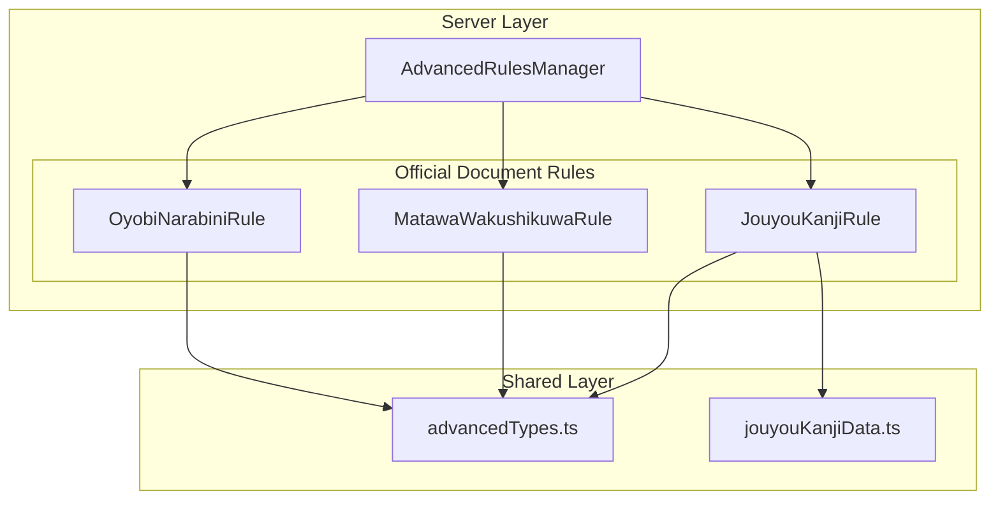

# Design Document: 公文書表記ルール

## Overview

公文書（公用文）作成における表記・用語ルールをチェックする機能を実装する。文化審議会建議「公用文作成の考え方」（2022年）および内閣告示を根拠とし、以下の3つのルールを追加する：

1. **「及び/並びに」使い分けルール** - 並列接続詞の階層構造チェック
2. **「又は/若しくは」使い分けルール** - 選択接続詞の階層構造チェック
3. **常用漢字外検出ルール** - 常用漢字表（2136字）に基づく検出

これらのルールは既存の `AdvancedRulesManager` に統合し、VSCode設定で個別にON/OFF可能とする。

## Architecture



## Components and Interfaces

### 1. OyobiNarabiniRule（及び/並びに使い分けルール）

```typescript
// server/src/grammar/rules/oyobiNarabiniRule.ts

import { Token } from '../../../../shared/src/types';
import {
  AdvancedGrammarRule,
  AdvancedRulesConfig,
  RuleContext,
  AdvancedDiagnostic,
  Sentence
} from '../../../../shared/src/advancedTypes';

/**
 * 「及び」「並びに」の使い分けをチェックするルール
 * 
 * 公用文のルール:
 * - 「及び」: 小さな並列（同レベルの要素を結ぶ）
 * - 「並びに」: 大きな並列（「及び」で結ばれたグループ同士を結ぶ）
 * - 「並びに」は「及び」と組み合わせて使う
 * - 「並びに」単独使用は不適切
 */
export class OyobiNarabiniRule implements AdvancedGrammarRule {
  name = 'oyobi-narabini';
  description = '「及び」「並びに」の使い分けをチェックします';

  check(tokens: Token[], context: RuleContext): AdvancedDiagnostic[];
  isEnabled(config: AdvancedRulesConfig): boolean;
}
```

### 2. MatawaWakushikuwaRule（又は/若しくは使い分けルール）

```typescript
// server/src/grammar/rules/matawaWakushikuwaRule.ts

/**
 * 「又は」「若しくは」の使い分けをチェックするルール
 * 
 * 公用文のルール:
 * - 「又は」: 大きな選択（最上位の選択肢を結ぶ）
 * - 「若しくは」: 小さな選択（下位の選択肢を結ぶ）
 * - 「若しくは」は「又は」と組み合わせて使う
 * - 「若しくは」単独使用は不適切
 */
export class MatawaWakushikuwaRule implements AdvancedGrammarRule {
  name = 'matawa-wakushikuwa';
  description = '「又は」「若しくは」の使い分けをチェックします';

  check(tokens: Token[], context: RuleContext): AdvancedDiagnostic[];
  isEnabled(config: AdvancedRulesConfig): boolean;
}
```

### 3. JouyouKanjiRule（常用漢字外検出ルール）

```typescript
// server/src/grammar/rules/jouyouKanjiRule.ts

/**
 * 常用漢字表にない漢字を検出するルール
 * 
 * 根拠: 常用漢字表（平成22年内閣告示第2号）
 * - 2136字の常用漢字を基準
 * - 固有名詞は除外オプションあり
 */
export class JouyouKanjiRule implements AdvancedGrammarRule {
  name = 'jouyou-kanji';
  description = '常用漢字表にない漢字を検出します';

  check(tokens: Token[], context: RuleContext): AdvancedDiagnostic[];
  isEnabled(config: AdvancedRulesConfig): boolean;
}
```

### 4. 常用漢字データ

```typescript
// shared/src/jouyouKanjiData.ts

/**
 * 常用漢字表（平成22年内閣告示第2号）
 * 2136字
 */
export const JOUYOU_KANJI_SET: Set<string>;

/**
 * 常用漢字外の漢字に対する代替提案
 * key: 常用漢字外の漢字
 * value: { hiragana: ひらがな表記, alternative?: 代替漢字 }
 */
export const NON_JOUYOU_ALTERNATIVES: Map<string, {
  hiragana: string;
  alternative?: string;
}>;
```

### 5. 設定型の拡張

```typescript
// shared/src/advancedTypes.ts に追加

// エラータイプ追加
export type AdvancedGrammarErrorType =
  | ... // 既存のタイプ
  | 'oyobi-narabini'      // 及び/並びに使い分け
  | 'matawa-wakushikuwa'  // 又は/若しくは使い分け
  | 'jouyou-kanji';       // 常用漢字外

// 設定追加
export interface AdvancedRulesConfig {
  // ... 既存の設定
  
  // 公文書ルール（Feature: official-document-rules）
  enableOyobiNarabini: boolean;
  enableMatawaWakushikuwa: boolean;
  enableJouyouKanji: boolean;
  excludeProperNounsFromJouyouKanji: boolean;
}
```

## Data Models

### 接続詞検出結果

```typescript
interface ConjunctionMatch {
  type: 'oyobi' | 'narabini' | 'matawa' | 'wakushikuwa';
  position: number;
  length: number;
}
```

### 常用漢字外検出結果

```typescript
interface NonJouyouKanji {
  kanji: string;
  position: number;
  isProperNoun: boolean;
  suggestion?: {
    hiragana: string;
    alternative?: string;
  };
}
```

## Correctness Properties

*A property is a characteristic or behavior that should hold true across all valid executions of a system-essentially, a formal statement about what the system should do. Properties serve as the bridge between human-readable specifications and machine-verifiable correctness guarantees.*

### Property 1: 接続詞検出の完全性

*For any* テキストに「及び」「並びに」「又は」「若しくは」が含まれる場合、該当するルールが有効であれば、すべての出現箇所が検出される。

**Validates: Requirements 1.1, 2.1**

### Property 2: 単独使用警告の正確性

*For any* 文において、「並びに」が含まれ「及び」が含まれない場合、警告が出力される。同様に「若しくは」が含まれ「又は」が含まれない場合も警告が出力される。

**Validates: Requirements 1.3, 2.3**

### Property 3: 常用漢字判定の正確性

*For any* 漢字について、常用漢字表（2136字）に含まれるかどうかの判定が正しい。常用漢字表に含まれる漢字は警告されず、含まれない漢字は警告される。

**Validates: Requirements 3.1, 3.2**

### Property 4: 固有名詞除外オプションの動作

*For any* 固有名詞（人名・地名・組織名）に含まれる常用漢字外の漢字について、除外オプションが有効な場合は警告が抑制される。

**Validates: Requirements 3.4**

### Property 5: 設定によるルール有効/無効の切り替え

*For any* ルールについて、設定でdisabledにした場合は診断が出力されず、enabledにした場合は診断が出力される。

**Validates: Requirements 4.1**

### Property 6: 診断メッセージの品質

*For any* 検出された問題について、診断メッセージには(1)問題の説明、(2)修正案、(3)根拠となる基準名が含まれる。

**Validates: Requirements 1.5, 2.5, 5.1, 5.2, 5.3**

### Property 7: 診断の重要度

*For any* 公文書ルールによる診断は、重要度が「情報」（DiagnosticSeverity.Information）である。

**Validates: Requirements 5.4**

## Error Handling

### 入力エラー

- 空のテキスト: 診断なしで正常終了
- 日本語以外のテキスト: 該当箇所なしとして処理

### 設定エラー

- 不正な設定値: デフォルト値にフォールバック
- 設定未定義: デフォルト値（公文書ルールは無効）を使用

### 常用漢字データエラー

- データ読み込み失敗: ルールを無効化し、エラーログを出力

## Testing Strategy

### 単体テスト

各ルールに対して以下のテストを実施：

1. **OyobiNarabiniRule**
   - 「及び」のみの文: 警告なし
   - 「並びに」単独使用: 警告あり
   - 「及び」と「並びに」の正しい組み合わせ: 警告なし
   - 3つ以上の要素を「及び」のみで並列: 提案あり

2. **MatawaWakushikuwaRule**
   - 「又は」のみの文: 警告なし
   - 「若しくは」単独使用: 警告あり
   - 「又は」と「若しくは」の正しい組み合わせ: 警告なし
   - 3つ以上の選択肢を「又は」のみで並列: 提案あり

3. **JouyouKanjiRule**
   - 常用漢字のみ: 警告なし
   - 常用漢字外を含む: 警告あり
   - 固有名詞除外オプション: 設定に応じた動作

### プロパティベーステスト

fast-checkを使用し、各プロパティに対して30回のテストを実施：

- **Property 1**: ランダムなテキストに接続詞を挿入し、検出を確認
- **Property 2**: 「並びに」「若しくは」を含むが対応する接続詞を含まないテキストで警告を確認
- **Property 3**: ランダムな漢字に対して常用漢字判定を確認
- **Property 5**: 設定のON/OFFを切り替えて診断の有無を確認
- **Property 6**: 診断メッセージの内容を確認
- **Property 7**: 診断のseverityを確認
