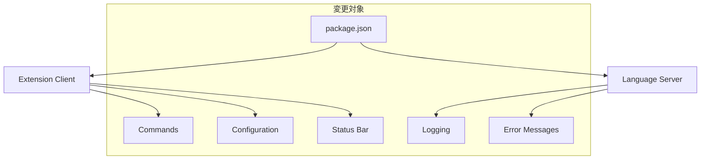

# 設計ドキュメント

## 概要

VSCode拡張機能「Japanese Grammar Analyzer」を正式名「otak-lcp」に統一するリファクタリング設計。パッケージメタデータ、コマンド識別子、設定項目、内部コード、ユーザーインターフェースを体系的に変更し、後方互換性を維持しながら段階的に移行する。

## アーキテクチャ

### 変更対象コンポーネント



### 命名規則マッピング

| 変更前 | 変更後 | 用途 |
|--------|--------|------|
| `japanese-grammar-analyzer` | `otak-lcp` | パッケージ名 |
| `Japanese Grammar Analyzer` | `otak-lcp - Japanese Grammar Analyzer` | 表示名 |
| `japaneseGrammarAnalyzer.*` | `otakLcp.*` | コマンド識別子 |
| `japaneseGrammarAnalyzer.*` | `otakLcp.*` | 設定キー |
| `Japanese Grammar Analyzer` | `otak-lcp` | ログメッセージ |

## コンポーネントと インターフェース

### 1. パッケージメタデータ (package.json)

**変更項目:**
- `name`: `otak-lcp`
- `displayName`: `otak-lcp - Japanese Grammar Analyzer`
- `commands`: 識別子を `otakLcp.*` に変更
- `configuration.title`: `otak-lcp`
- `configuration.properties`: キーを `otakLcp.*` に変更

### 2. Extension Client (client/src/extension.ts)

**変更項目:**
- Language Client識別子: `otakLcp`
- Output Channel名: `otak-lcp`
- ステータスバーテキスト: `otak-lcp`
- コマンド登録: `otakLcp.*`
- 設定読み込み: `otakLcp.*`

### 3. Language Server (server/src/main.ts)

**変更項目:**
- ログメッセージ: `otak-lcp Language Server`
- エラーメッセージ: `otak-lcp`
- 設定読み込み: `otakLcp.*`

### 4. 設定移行システム

**新規コンポーネント:**
- 古い設定キーの検出
- 新しいキーへの値コピー
- 移行完了通知
- 古い設定の削除（オプション）

## データモデル

### 設定移行マッピング

```typescript
interface SettingMigration {
  oldKey: string;
  newKey: string;
  type: 'boolean' | 'string' | 'number' | 'array' | 'object';
  defaultValue?: any;
}

const SETTING_MIGRATIONS: SettingMigration[] = [
  {
    oldKey: 'japaneseGrammarAnalyzer.enableGrammarCheck',
    newKey: 'otakLcp.enableGrammarCheck',
    type: 'boolean'
  },
  // ... 他の設定項目
];
```

### コマンド移行マッピング

```typescript
interface CommandMigration {
  oldCommand: string;
  newCommand: string;
  title: string;
}

const COMMAND_MIGRATIONS: CommandMigration[] = [
  {
    oldCommand: 'japaneseGrammarAnalyzer.toggle',
    newCommand: 'otakLcp.toggle',
    title: 'otak-lcp: ON/OFF切り替え'
  },
  // ... 他のコマンド
];
```

## 正確性プロパティ

*プロパティは、システムのすべての有効な実行において真であるべき特性や動作です。プロパティは、人間が読める仕様と機械で検証可能な正確性保証の橋渡しとなります。*

### プロパティ反映

プロパティの冗長性を排除するため、以下の統合を行います：

- プロパティ1とプロパティ4: パッケージ情報と拡張機能一覧の表示は同じ表示名形式を使用するため統合
- プロパティ5とプロパティ8: ログメッセージ出力は同じルールを適用するため統合
- プロパティ6とプロパティ11: 設定移行とコマンドリダイレクトは同じ後方互換性メカニズムを使用するため統合

### 正確性プロパティ

プロパティ1: パッケージ表示名の一貫性
*任意の* パッケージ情報表示において、メイン名は「otak-lcp」、詳細表示名は「otak-lcp - Japanese Grammar Analyzer」の形式で表示される
**検証対象: 要件 1.1, 1.2, 1.4**

プロパティ2: ログメッセージの命名統一
*任意の* ログメッセージやエラーメッセージにおいて、「otak-lcp」が使用される
**検証対象: 要件 1.5, 4.2, 4.3**

プロパティ3: コマンド識別子の形式統一
*任意の* コマンド実行において、識別子は「otakLcp.*」形式を使用し、タイトルは「otak-lcp:」プレフィックスを使用する
**検証対象: 要件 2.1, 2.2**

プロパティ4: 設定キーの形式統一
*任意の* 設定変更において、キーは「otakLcp.*」形式を使用し、カテゴリは「otak-lcp」を使用する
**検証対象: 要件 3.1, 3.2, 3.4**

プロパティ5: 内部コードの命名統一
*任意の* Language Server初期化、クラス・関数定義、コメント・文書において、「otakLcp」または「otak-lcp」命名規則を使用する
**検証対象: 要件 4.1, 4.4, 4.5**

プロパティ6: 後方互換性の維持
*任意の* 古い設定キーまたはコマンド識別子の使用において、新しいキーまたは識別子に自動移行またはリダイレクトされる
**検証対象: 要件 2.3, 3.3, 5.1, 5.2**

プロパティ7: 移行処理の通知
*任意の* 移行処理において、成功時は完了通知、失敗時は適切なエラーメッセージが表示される
**検証対象: 要件 5.3, 5.4**

プロパティ8: ユーザー確認の要求
*任意の* 古い設定削除において、ユーザーの確認が求められる
**検証対象: 要件 5.5**

## エラー処理

### 移行エラー

- **設定読み込み失敗**: 古い設定の読み込みに失敗した場合、デフォルト値を使用
- **設定書き込み失敗**: 新しい設定の書き込みに失敗した場合、エラーメッセージを表示
- **コマンド登録失敗**: 新しいコマンドの登録に失敗した場合、古いコマンドを維持

### 後方互換性エラー

- **古いコマンド呼び出し**: 古いコマンドが呼び出された場合、新しいコマンドにリダイレクト
- **古い設定キー使用**: 古い設定キーが使用された場合、新しいキーの値を返す
- **移行処理重複**: 移行処理が重複実行された場合、スキップして正常終了

## テスト戦略

### 単体テスト

- パッケージメタデータの検証
- 設定移行ロジックの検証
- コマンド登録の検証
- エラーハンドリングの検証

### プロパティベーステスト

- fast-checkライブラリを使用
- テスト実行回数: 30回
- 各正確性プロパティに対応するテストを実装
- ランダムな設定値、コマンド名、ログメッセージでテスト

**テスト設定:**
```typescript
fc.assert(property, { numRuns: 30 });
```

### 統合テスト

- VSCode拡張機能としての動作確認
- Language Serverとの連携確認
- 設定画面での表示確認
- コマンドパレットでの動作確認