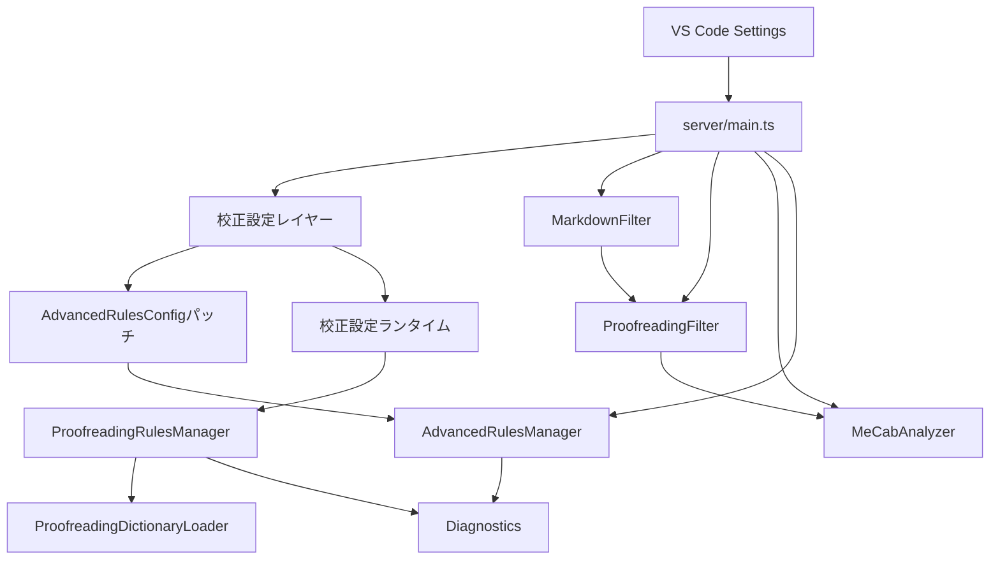

# 設計書: 校正設定互換

## 概要
動画で提示された「校正設定の確認」画面で提供される観点を、otak-lspの設定と診断ルールとして提供する。既存の文法/表記ルールは再利用し、不足分は辞書ベース/ルールベースの拡張として追加する。設定は VS Code の `otakLsp.proofreading.*` で管理し、動画のチェック状態を再現できる互換プリセットを提供する。

## アーキテクチャ



## 設計方針
- **既存ルールの再利用**: ら抜き/二重敬語/同音語/表記ゆれなどは `AdvancedRulesManager` の既存ルールを活用する。
- **互換設定レイヤー**: 校正設定カテゴリを `otakLsp.proofreading.*` で表現し、既存ルールの有効化/閾値にマッピングする。
- **新規ルールは独立管理**: 校正設定固有の未対応項目は `ProofreadingRulesManager` で実装する。
- **オフライン完結**: ルール辞書・校正辞書・スペル辞書はローカルファイルのみを参照する。
- **位置保持**: 既存のMarkdownフィルタと同様に、除外範囲はスペース置換で長さを維持する。

## 設定設計

### 設定キー概要
- `otakLsp.proofreading.preset`: 互換プリセット（例: `video-default` / `custom`）
- `otakLsp.proofreading.mergeMode`: `override` / `merge`（advanced設定との統合方式）
- `otakLsp.proofreading.categories.*`: 各カテゴリのON/OFFと詳細設定
- `otakLsp.proofreading.dictionaries.*`: ルール辞書/校正辞書/スペル辞書のパス
- `otakLsp.proofreading.description`: 校正設定の詳細説明

### プリセット適用方針
- `preset=video-default` の場合、動画のチェック状態を校正設定カテゴリのデフォルト値として適用する。
- `mergeMode=override` の場合は校正設定を優先し、`merge` の場合は advanced 設定と OR で統合する。
- プリセットはサーバー側で「実効設定」として計算する（VS Codeの設定値を書き換えない）。

## 互換マッピング

### 既存ルールへの対応付け（抜粋）
| 校正設定カテゴリ | 項目 | 既存ルール/設定 |
| --- | --- | --- |
| 誤字チェック | ら抜き表現 | `enableRaNukiDetection` |
| 誤字チェック | 二重敬語 | `enableHonorificError` |
| 誤字チェック | 同音語誤り | `enableHomophone` |
| 誤字チェック | 呼応表現 | `enableAdverbAgreement` |
| 用語基準 | 送り仮名 | `enableOkuriganaVariant` |
| 用語基準 | 常用漢字 | `enableJouyouKanji` |
| 用語基準 | 旧字体 | `enableOrthographyVariant` で代替 |
| 用語基準 | 難しい語の言い換え | `enableKanjiOpening` |
| 表現洗練 | 文体の統一 | `enableStyleConsistency` |
| 表現洗練 | 同一助詞の連続 | `enableParticleRepetition` |
| 表現洗練 | 二重否定 | `enableDoubleNegation` |
| 表現洗練 | 回りくどい表現 | `enableTwistedSentence` |
| 字種統一 | 句読点 | `enablePunctuationStyleMix` |
| 字種統一 | 数字 | `enableNumberWidthMix` / `enableNumeralStyleMix` |
| 字種統一 | 記号 | `enableSymbolWidthMix` / `enableDashTildeNormalization` |
| 字種統一 | アルファベット | `enableAlphabetWidth` / `enableEnglishCaseMix` |
| 長さチェック | 文 | `enableLongSentence` + `longSentenceThreshold` |
| 長さチェック | 句読点 | `enableCommaCount` + `commaCountThreshold` |
| 表記ゆれ | 表記ゆれ | `enableOrthographyVariant` |
| 括弧 | 対応 | `enableBracketQuoteMismatch` |

### 新規ルールが必要な項目
- 誤字脱字/擬音語・擬態語/仮名遣い/慣用表現/略称表記/正式名称/変更された名称/商標・商品名
- さ入れ表現/西暦・和暦の元年統一
- 記者ハンドブック/外来語表記/略語
- 並列関係/ビジネス文/命令的表現/くだけた表現/たりの脱落/べく止め
- 文字種の優先表記（単位/句読点/カタカナ/数字/記号/アルファベット/半角全角）
- 文字種連続の長さ（ひらがな/カタカナ/漢字）
- 環境依存文字/印刷標準字体
- 約物の偶数チェック/空白ルール/閉じ括弧前句点
- ルール辞書/スペル辞書/校正辞書
- 括弧階層の深さ
- 引用行の除外

## コンポーネント設計

### 校正設定レイヤー
`server/src/proofreading/proofreadingConfig.ts` で設定の読込と実効設定の計算を行う。

```typescript
export interface ProofreadingSettingsConfig {
  preset: 'video-default' | 'custom';
  mergeMode: 'override' | 'merge';
  categories: {
    typo: { enable: boolean; checkInBrackets: boolean; ... };
    termBase: { enable: boolean; okurigana: boolean; jouyouKanji: boolean; ... };
    expression: { enable: boolean; styleConsistency: boolean; ... };
    charType: { enable: boolean; preferred: { numeral: 'full' | 'half' | 'mix'; ... } };
    length: { enable: boolean; sentence: number; comma: number; ... };
    envDependent: { enable: boolean; mode: 'all' | 'partial' };
    punctuation: { enable: boolean; evenLeader: boolean; spaceAfterQ: boolean; ... };
    spell: { enable: boolean; checkUppercase: boolean; ... };
    notationVariant: { enable: boolean; katakanaOnly: boolean; ... };
    bracket: { enable: boolean; maxDepth: number };
    quoteLine: { enable: boolean; markers: string[] };
  };
  dictionaries: {
    proofreading: string[];
    spell: string[];
    rule: string[];
  };
  description: string;
}
```

### ProofreadingRulesManager
`server/src/grammar/proofreadingRulesManager.ts` を追加し、校正設定向けの新規ルールを集約する。
- 既存 `AdvancedRulesManager` とは独立して動作。
- 既存ルールでカバーできる項目は `AdvancedRulesConfig` パッチで再利用する。

### Dictionary Loader
`server/src/dictionaries/proofreadingDictionaryLoader.ts`
- 指定された辞書ファイルを読み込み、カテゴリ別に索引化する。
- 変更検知で再読み込み（ファイル監視またはタイムスタンプ比較）。
- 解析失敗時は警告ログのみ、解析は継続。

### 新規ルール群（代表例）
- `ProofreadingDictionaryRule`: 誤字/慣用表現/用語基準2/商標など辞書ベース検出
- `EraFirstYearRule`: 和暦の初年を「元年」に統一
- `CharTypeRunLengthRule`: ひらがな/カタカナ/漢字の連続長
- `EnvironmentDependentCharRule`: 機種依存文字/Unicode未対応文字
- `PrintingStandardGlyphRule`: 印刷標準字体の検出
- `PunctuationEvenCountRule`: 二点リーダ/ダッシュ/波線の偶数チェック
- `PunctuationSpacingRule`: 疑問符/感嘆符後の空白、行頭空白、閉じ括弧前句点
- `BracketDepthRule`: 括弧の階層深さチェック
- `SpellCheckRule`: 英単語のスペルと形式ルール（大文字/数字/繰り返し）
- `RuleDictionaryRule`: ルール辞書による検出（正規表現/固定表現）
- `QuoteLineFilter`: 引用行除外のフィルタ（前処理）

## 辞書設計

### 辞書形式（JSON）
```json
[
  {
    "category": "typo",
    "match": "きづく",
    "replace": "気づく",
    "message": "誤字脱字の疑いがあります",
    "mode": "exact"
  }
]
```

- `category`: 校正設定項目に対応する分類
- `match`: 検出文字列（`mode=regex` の場合は正規表現）
- `replace`: 修正案（省略可）
- `message`: 任意のメッセージ
- `mode`: `exact` / `regex`

### スペル辞書形式（単語リスト）
- 1行1単語（ASCII/UTF-8）
- `#` から始まる行はコメントとして無視

### ルール辞書形式
- JSON配列形式で、`pattern`（正規表現）と `message` を持つエントリを許可

## フィルタリングと範囲処理
- `QuoteLineFilter` は設定された記号で始まる行をスペース置換し、除外範囲として保持する。
- 「括弧内もチェックする」オプションは `BracketRangeDetector` で括弧範囲を検出し、ルールごとに適用する。
- Markdownの除外範囲（コードブロック/テーブル等）は従来通り `MarkdownFilter` を使用する。

## データモデル

```typescript
export interface DictionaryEntry {
  category: string;
  match: string;
  replace?: string;
  message?: string;
  mode?: 'exact' | 'regex';
}

export interface RuleDictionaryEntry {
  pattern: string;
  message: string;
  severity?: 'info' | 'warn';
}

export interface SpellOptions {
  allowUppercase: boolean;
  allowAllCaps: boolean;
  allowDigits: boolean;
  allowFullwidth: boolean;
  allowEmailUrl: boolean;
  allowRepeat: boolean;
  allowSentenceLowercase: boolean;
}
```

## 正当性プロパティ

1. **設定反映の正確性**  
   *For any* `otakLsp.proofreading.*` の設定変更は、次回解析に即時反映される。  
   **対応:** 要件1.3

2. **互換プリセットの再現性**  
   *For any* `preset=video-default` の場合、動画のチェック状態と一致する実効設定が生成される。  
   **対応:** 要件1.5

3. **辞書検出の完全性**  
   *For any* 辞書に登録された表記が本文に出現した場合、該当カテゴリの診断が出力される。  
   **対応:** 要件2.1, 3.4, 4.1, 11.1

4. **除外範囲の安全性**  
   *For any* 引用行や括弧内除外が有効な場合、該当範囲内の指摘は抑制される。  
   **対応:** 要件2.4, 5.5, 17.3

5. **オフライン動作**  
   *For any* ルール実行はローカル辞書とルールのみで完結し、ネットワークアクセスを行わない。  
   **対応:** 要件19.2

## エラーハンドリング
- 辞書ファイルが見つからない場合: 警告ログを出し、その辞書のみ無効化。
- 辞書エントリが不正: エントリ単位で無視し、処理継続。
- 設定値が不正: デフォルト値にフォールバック。
- 解析中例外: 既存の解析全体停止を避け、該当ルールのみ無効化。

## テスト戦略

### 単体テスト
- `ProofreadingConfigMapper`: preset/mergeModeの挙動
- `DictionaryLoader`: JSON/単語リストの読み込み
- `QuoteLineFilter`: 先頭記号の除外処理
- 各新規ルール（EraFirstYear/CharTypeRunLength/EnvironmentDependent 等）

### 統合テスト
- Markdownフィルタと引用行フィルタの併用
- 既存Advancedルールとの重複指摘が出ないこと

### プロパティベーステスト
- 文字種連続長のしきい値判定（fast-check, numRuns=30）
- 括弧階層の深さ判定（ランダム括弧列）
